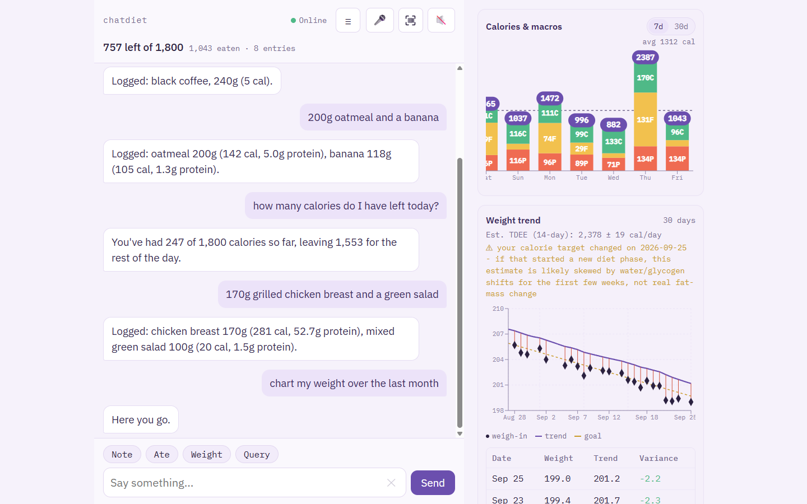
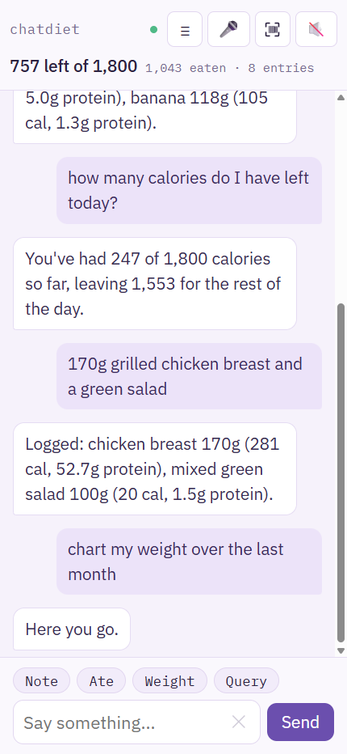
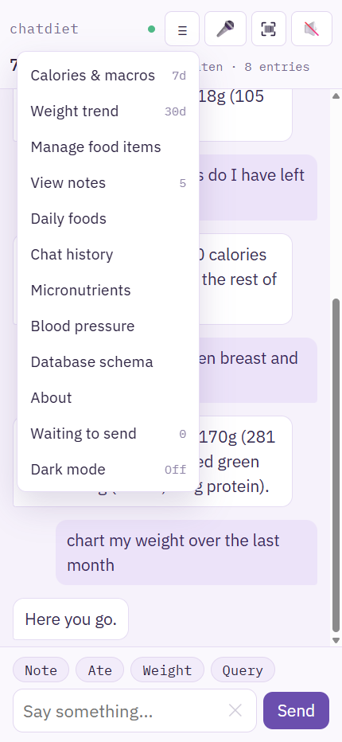
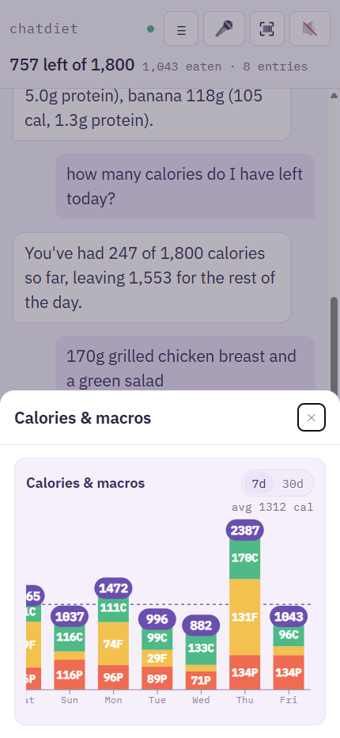
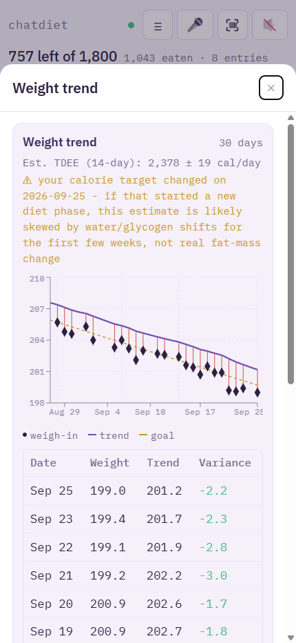
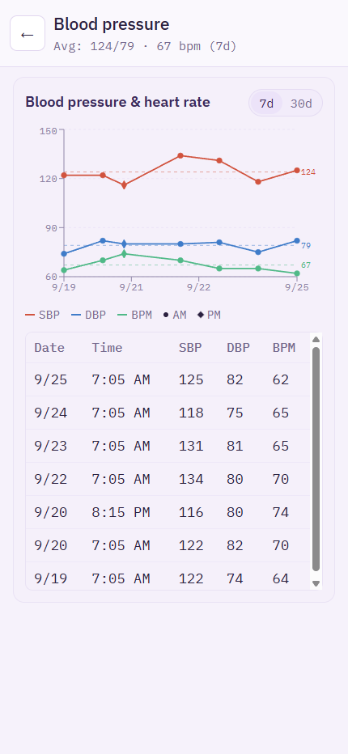

# chat-diet

A self-hosted, single-user diet and health tracker where **chat is the primary
interface**. You tell it what you ate in whatever words come naturally — "3 slices
honey wheat bread", "250 cal of orange juice", "142g cheerios" — and it resolves the
food, computes the nutrition, and logs it. Ask it questions back in the same window:
how many calories are left today, what you ate on Tuesday, chart your weight trend,
or run an arbitrary analytical query over your own history.

Built as a personal PWA running on a home server, reachable from phone and desktop
over a private Tailscale network.



## Why it works this way

**The database is private, and that is the point.** Food logging only produces useful
data if it is honest, and honesty is much easier when the log is genuinely yours —
not uploaded to a service, not monetized, not shared. Every entry lives in a single
SQLite file on hardware you control. That design choice is the app's main feature,
not an implementation detail.

**Chat removes the friction that kills logging habits.** Conventional trackers make
you search a database, pick a match, choose a serving unit, and confirm. Here you type
a phrase and it saves — optimizing for speed over false precision, because a slightly
overestimated entry logged in three seconds beats a perfect entry you skipped.

## What it does

**Logging** — food (by name or UPC barcode scan), body weight, blood pressure and
heart rate, exercise, digestive events, and freeform timestamped notes. Corrections
are understood conversationally ("make that two slices", "the scale actually said
181") and update the existing entry rather than creating a duplicate.

**Food resolution** — a stated phrase is resolved in tiers: a local alias/item cache
of foods you have eaten before, then USDA FoodData Central for generic foods, then
Open Food Facts for scanned barcodes, and finally a model estimate as a fallback.
Amount phrases are parsed in whatever form you give them — grams, servings, portion
units ("2 slices", "1 cup"), or a stated calorie count inverted back into grams.
Ambiguous names produce a short numbered list to pick from instead of a wrong guess.

**Analysis** — a manually set daily calorie target, adaptive TDEE back-calculated from
logged intake against the actual weight trend (not a generic BMR formula), weight
projections toward a goal weight or date, fasting duration, and a smoothed
Hacker's-Diet-style weight trend line.

**Charts and ad-hoc queries** — calories, macros, weight, and deficit charted over any
time frame the model resolves from plain language ("last 3 months", "this week").
For anything the built-in tools don't cover, a SQL agent turns the question into a
query against the schema and renders the result table inline.

**Blood pressure import** — OMRON monitor CSV exports are upserted by timestamp, so
re-importing overlapping date ranges never duplicates rows.

## Interface

Chat is the main surface. Alongside it sit read-only browsing pages (charts, chat
history, foods, micronutrients, vitals, notes, schema), a permanent dashboard for
at-a-glance daily totals, and one deliberate data-entry exception for managing Food
Items directly.

The frontend is a responsive React PWA with light and dark themes — it works as a
desktop web app and installs as a mobile app, with an offline queue that drains when
the connection returns. An optional Alexa skill allows voice logging.

| Logging by chat | Navigation | Calories & macros |
|---|---|---|
|  |  |  |

The same data also drives the trend views — a smoothed weight line with its goal
track and a back-calculated TDEE, and blood pressure charted with its own running
averages:

| Weight trend | Blood pressure |
|---|---|
|  |  |

## Architecture

The LLM is a router, not a calculator. An intent registry (`intents.yaml`) maps
intents to tool sets and prompt fragments, and only the relevant fragments are
assembled into each turn's system prompt. Keeping API cost under $10/month is a hard
design driver, not an afterthought.

Two details exist because a chat interface can silently lose data:

- **Fast path** — simple, unambiguous entries are parsed deterministically and saved
  without ever calling the model, making common logging instant and free.
- **Claim verification** — if the model's reply *claims* something was logged but no
  tool actually ran, a detector catches it and retries, so a confident-sounding reply
  can never quietly stand in for a real database write.

### Stack

| Layer | Technology |
|---|---|
| Backend | Java 21, Spring Boot 4.1, Spring Data JDBC, Liquibase |
| LLM | Anthropic Claude (Haiku) via Spring AI |
| Database | SQLite, file-mode, single file |
| Frontend | React 19, Redux Toolkit, Recharts, Vite, vite-plugin-pwa |
| Barcode | ZXing (backend), camera scanning (PWA) |
| Voice | Alexa ASK SDK |
| Deployment | Docker on a home server, HTTPS via Tailscale-issued cert |

## Security model

This is explicitly a **single-user app with no authentication**, by design. It is
protected by network isolation: the app is served only on a private Tailscale network
(port 8443), not the public internet. The one exception is `/alexa`, exposed publicly
through Tailscale Funnel and authenticated by Alexa request-signature verification
plus a skill-ID check.

If you deploy this somewhere reachable from the open internet, you must add
authentication yourself. See `scripts/TAILSCALE-ALEXA-CONFIG.md` for the network
topology.

## Running it

See **[HOW-TO-RUN.md](HOW-TO-RUN.md)**. In short: copy
`backend/src/main/resources/application.yml.example` to `application.yml`, fill in
your Anthropic API key and personal biometrics (that file is gitignored), then
`gradlew bootRun` in `backend/`. The SQLite database and its schema are created
automatically on first run.

### Try it with demo data

A fresh database is empty, which makes the charts hard to judge. [`demo/`](demo/)
holds a ready-to-run database of 60 days of generated data — the screenshots above
are taken from it:

```
copy demo\chat-diet-demo.db backend\data\
cd backend
gradlew bootRun --args="--spring.datasource.url=jdbc:sqlite:./data/chat-diet-demo.db"
```

Every screen except the chat box works without an API key. See
[demo/README.md](demo/README.md) for how it is generated.

## Documentation

| Document | Contents |
|---|---|
| [SPEC.md](SPEC.md) | Full design specification as implemented |
| [USER-GUIDE.md](USER-GUIDE.md) | What you can say to the app |
| [HOW-TO-RUN.md](HOW-TO-RUN.md) | Local dev and Docker deployment |
| [demo/](demo/) | Ready-to-run database of generated data, and how to regenerate it |
| [docs/](docs/) | Design notes, architecture assessments, Alexa skill specs |

## Status

Actively used daily by its author and effective in practice. The roadmap is roughly:
continue refining through a year of real use, then open it to family members to find
out whether it works as well for people who did not build it, and consider a published
release only if it does.

Because it was built for one person, some behavior is still tuned to that person's
habits — shorthand phrases, portion defaults, and imperial units throughout.

## License

MIT — see [LICENSE](LICENSE).
