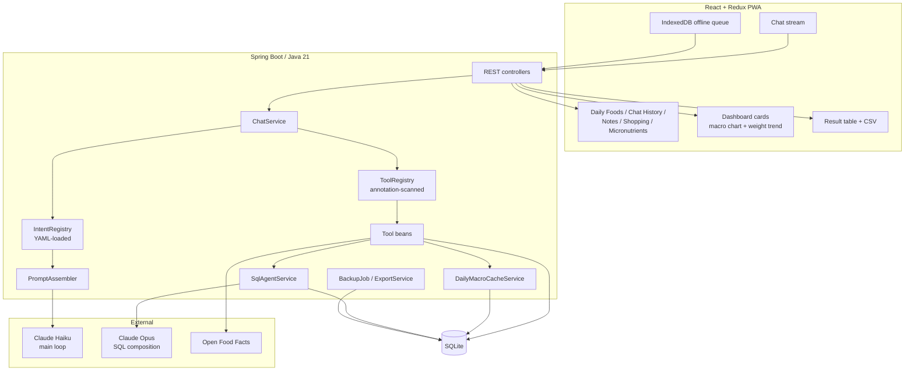
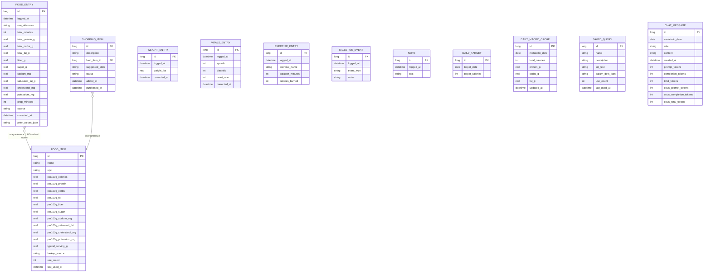
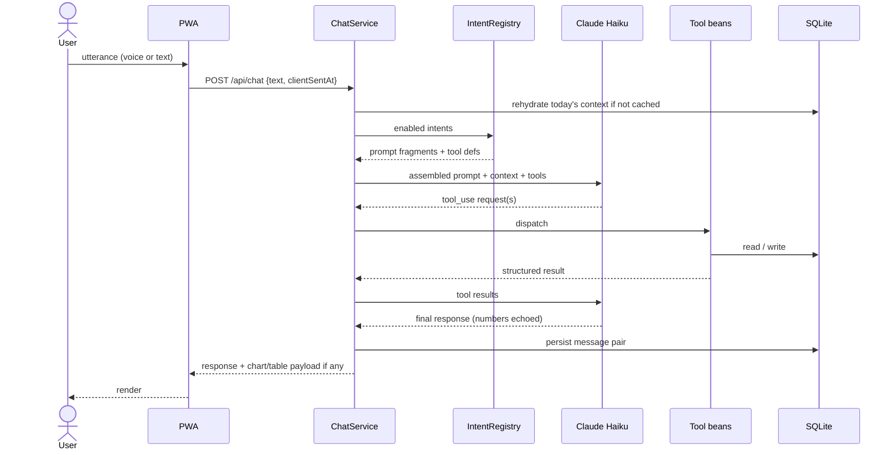
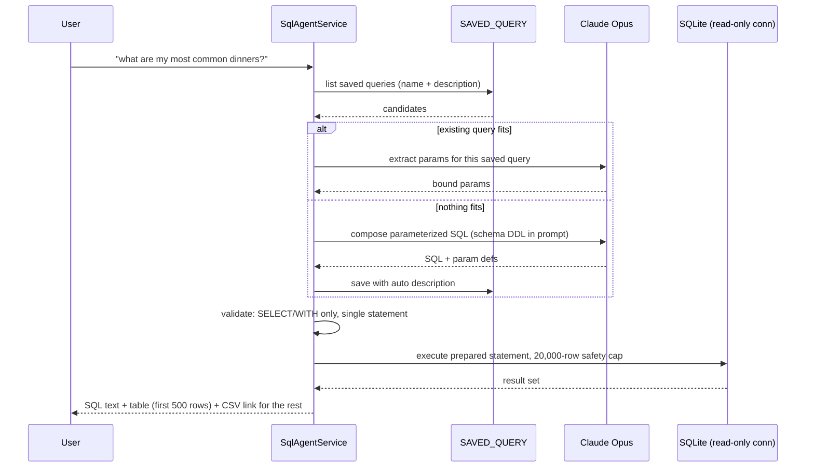
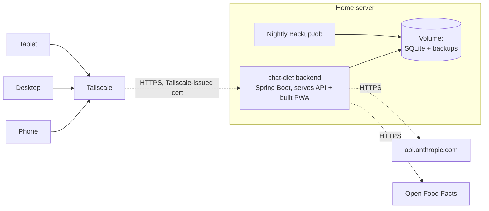

# chat-diet — Design Specification

A single-user conversational app for logging food, weight, vitals, exercise,
and shopping, with nutrition math and ad-hoc analytics. Chat is the primary
interface; a handful of read-only pages and a permanent dashboard sit
alongside it for browsing and at-a-glance totals.

Reflects the app as implemented. Originally written as a pre-implementation
brief; this revision replaces that draft after a simplification pass dropped
or reshaped several subsystems (see the Appendix for what changed and why).

---

## 1. Constraints and principles

| Constraint | Value |
|---|---|
| Users | Exactly one (the owner). No auth beyond network isolation. |
| Access | Tailscale on home network. No public exposure. |
| Deployment | Single Docker container on a home server; HTTPS served directly via a Tailscale-issued cert. |
| Backend | Java 21 on Spring Boot, Spring AI for Anthropic. |
| Frontend | React + Redux PWA, light/dark theme, Recharts. |
| Database | SQLite (file-mode), Liquibase-managed schema. |
| Build | Gradle. Monorepo (backend + frontend). |
| LLM | Claude API only. No local models. |
| API budget | Under $10/month. This is a hard design driver. |
| Units | Imperial (lbs, oz, cups). |
| Time | Local time only. No timezone handling. |

### Java 21 conventions

| Feature | Where |
|---|---|
| Records | Tool request/response DTOs, entities (via Spring Data JDBC, not JPA — no mutable-field/no-arg-constructor requirement to work around), chart series. |
| Sealed interfaces + pattern matching | `ToolResult` variants. Exhaustive `switch` over enum-plus-if-chains. |
| Text blocks | Prompt fragments, base system prompt, SQL-agent schema DDL block. |
| Streams | Nutrition aggregation, daily bucketing, chart series computation. |
| `var` | Locals where the right-hand side makes the type obvious. |

Avoid Lombok. Records cover most of what it was used for, and the annotation
processor is one more thing to break.

### Behavioral principles

These are not features. They constrain every response the app produces.

1. **The app is not a nanny.** It never volunteers commentary on data — not
   out-of-range vitals, not calorie progress, not food choices. It answers what
   is asked and logs what it is told.
2. **Echo every number.** Any numeric value persisted is read back in the
   response so transcription errors are visible immediately.
3. **Save immediately, correct after.** No confirmation gate before writing.
4. **Corrections must be linguistically marked.** "The correct BP is 156 over
   65", "make that two slices". A bare number is *always* a new entry, never
   inferred as a correction.
5. **Target ~80% nutrient accuracy for free-text estimates.** The scale is
   ground truth; the food log is a noisy estimator. Drift is expected. UPC
   lookups are the exception — those carry real Open Food Facts data, not an
   estimate.
6. **Sub-10-calorie items are not logged.** Black tea, water. Brief
   acknowledgement, no row written.

---

## 2. Architecture

A single agent with a tool belt, not an orchestrator with sub-agents. Intents
are data (YAML), so the extension seam for future specialization is promoting
an intent group to its own prompt/toolset without restructuring anything.



### Model tiering

Cost discipline lives here.

| Model | Used for | Frequency |
|---|---|---|
| Haiku (`claude-haiku-4-5`) | Main chat loop, all logging and queries | Every turn |
| Opus (`claude-opus-4-5`) | SQL composition from natural language | Rare — saved-query reuse handles the common case |

---

## 3. Data model

One row per logged utterance — no line-item/multi-ingredient breakdown, no
recipe system, no per-item cost tracking.



### Notes on the model

- **`source`** on `FOOD_ENTRY`/`FOOD_ITEM` is a free-text tag (`MANUAL`, `UPC`,
  or a cached-item's original lookup source) — not a closed enum, since there's
  no menu/recipe/photo-estimate provenance to distinguish anymore.
- **Micronutrients** (fiber, sugar, sodium, saturated fat, cholesterol,
  potassium) live on both `FOOD_ENTRY` and `FOOD_ITEM`. For free-text logging
  the model estimates them alongside calories/macros; for UPC-identified
  foods they come from Open Food Facts and are scaled deterministically by
  portion size, same as the macros.
- **`FOOD_ITEM`** is a nutrition-lookup/reuse cache (by UPC or fuzzy name
  match), not a recipe or multi-ingredient concept — logging a cached item
  just scales its per-100g values by the amount eaten.
- **`SHOPPING_ITEM`** transitions `PENDING → PURCHASED` in place (`purchased()`
  / `pending()`), recording the store and timestamp on the same row — there's
  no separate purchase-history table.
- **`DAILY_TARGET`** is a manually-set calorie goal, effective from
  `target_date` until a later goal supersedes it (carry-forward semantics).
  No computed fields (no TDEE, no weight-used-for-calculation) — see §7.
- **Corrections** are in-place updates with `corrected_at` plus
  `prior_values_json` (a full JSON snapshot of the row before the correction)
  as an audit trail. Not delete-and-reinsert.
- **No clothing-state on weight entries.** Considered and rejected: clothing
  variance is smaller than time-of-day variance and both wash out over the
  trend. The timestamp is the time-of-day metadata.

### Day boundary

Daily totals roll over at a **configurable hour, default 04:00**
(`chat-diet.day-rollover-hour`) — not calendar midnight. Late-night eating
counts toward the prior day.

The metabolic day is **also the conversation boundary** — there is no separate
session concept. Every device and channel writing on the same metabolic day
appends to the same thread; `ConversationHistoryStore` rehydrates a day's
context from `CHAT_MESSAGE` on first access rather than keeping it resident.

---

## 4. Intent registry

Intents are **data, not code**, loaded from `intents.yaml` at startup and
grouping tool beans discovered by component scan.

```java
public record IntentDefinition(
        String name,
        String description,
        List<String> toolNames,
        String promptFragment,
        boolean enabled
) {}
```

The system prompt is **assembled, not hand-written**:

```
[base persona + behavioral principles from §1]
+ [current date, time, day-rollover hour]
+ for each enabled intent: promptFragment
+ [tool definitions: union of enabled intents' toolNames]
```

Adding an intent is one YAML block plus any new tool beans. Zero edits to
existing intents, to the base prompt, or to `ChatService`.

### Current intents

| Intent | Purpose |
|---|---|
| `log_food` | Named-food logging (LLM-estimated), UPC logging (Open Food Facts), and cached-item reuse |
| `log_weight` | Weight entries |
| `log_vitals` | BP / heart rate |
| `log_exercise` | Exercise by name |
| `log_digestive_event` | Reflux, diarrhea, etc. |
| `save_note` | Freeform timestamped notes-to-self |
| `manage_goal` | Set the manual daily calorie target |
| `manage_shopping` | Add / list / mark purchased / bulk-add from a picker |
| `correct_entry` | Marked corrections to any recent entry |
| `query_data` | Totals, fasting duration, weight projection, current target, entry lookups |
| `show_chart` | Ad-hoc chart requests with flexible time frames |
| `run_sql` | Natural-language → SQL → result table |

`capture_requirement` and `recipe_intake` (both present in an earlier design)
no longer exist — see the Appendix.

### Current tool roster

`log_weight`, `correct_weight_entry`, `log_vitals`, `correct_vitals_entry`,
`log_exercise`, `log_digestive_event`, `save_note`, `log_food`,
`log_food_by_upc`, `log_cached_food`, `correct_food_entry`,
`list_food_entries`, `set_calorie_goal`, `get_daily_target`,
`get_weight_projection`, `get_fasting_status`, `add_shopping_item`,
`add_shopping_items_bulk`, `list_shopping_items`,
`list_food_items_for_shopping`, `mark_shopping_item_purchased`,
`revert_shopping_item_purchased`, `show_chart`, `run_sql`.

### Tool discovery

```java
public sealed interface ToolResult {
    record Success(String message, Object payload) implements ToolResult {}
    record NeedsClarification(String question, Object partial) implements ToolResult {}
    record NotFound(String what) implements ToolResult {}
}

@Component
@IntentTool(name = "save_note", intents = {"save_note"}, description = "...")
public class SaveNoteTool implements Function<SaveNoteRequest, ToolResult> {
    @Override
    public ToolResult apply(SaveNoteRequest req) {
        // ...
    }
}
```

`ToolResult` as a sealed interface gives exhaustive pattern matching in
`ChatService` when marshalling results back to the model. Component scan +
annotation means the registry discovers tools rather than maintaining a
manual mapping. New tool = new class.

---

## 5. Chat lifecycle



### Daily virtual sessions

- Sessions are **implicit**: one per metabolic day, created lazily on the
  day's first message. No button, no timeout, no explicit end.
- All channels — PWA, desktop, voice — share the same daily conversation, so
  the thread follows the user across devices rather than per tab.
- A turn is filed under the day it was **composed**, not the day it arrived,
  so a message queued offline before the rollover stays with its own day.
- The model is replayed the **last `chat-diet.chat.context-messages`
  messages** (default 10) of the current metabolic day. `GET
  /api/chat/history` (optionally with a `date` param, for the Chat History
  page) returns the whole day for display. Chart and SQL-table attachments
  are not persisted, so a restored transcript is text-only — the prose reply
  still carries the numbers.
- **The DB is the real memory.** Chat context stays short; recall of earlier
  facts happens through DB-reading tools, not by keeping long transcripts in
  context. This is the primary cost control.

### Offline

An explicit app-level **IndexedDB queue** (`frontend/src/lib/offlineQueue.ts`)
holds writes composed while the backend is unreachable and replays them on
reconnect, in order. This replaced an earlier Workbox background-sync queue
specifically because the queue panel (a header-menu overlay) needs to list
and remove individual pending messages, which Workbox's queue can't do. Log
entries carry client-side timestamps so queued entries land at the time they
happened, not the time they synced.

---

## 6. Food logging paths

```mermaid
stateDiagram-v2
    [*] --> Utterance
    Utterance --> NameMatch: named food
    Utterance --> UpcPath: UPC (typed, spoken, or camera-scanned)
    Utterance --> CachedMatch: matches a previously logged/cached item

    NameMatch --> Estimate: model estimates calories, macros, micronutrients
    Estimate --> Persist

    UpcPath --> Decode: camera photo only - ZXing, full res
    Decode --> Lookup: Open Food Facts
    Lookup --> CacheItem: create/update FOOD_ITEM (real macro + micronutrient data)
    CacheItem --> Scale: scale per-100g values by amount eaten
    Scale --> Persist

    CachedMatch --> Scale

    Persist --> Echo: read numbers back
    Echo --> [*]
    Persist --> UnderTen: <10 cal
    UnderTen --> [*]: ack, no row
```

A camera button in the header (chat screen only) captures a barcode photo,
POSTs it to `POST /api/barcode/decode` (ZXing, server-side, full resolution —
downscaling destroys barcode density), and relays the decoded UPC into chat
as plain text — reusing the same `log_food_by_upc` path a typed or spoken UPC
already goes through, rather than adding a separate mutation route.

Open Food Facts is the only external nutrition source. It supplies real
calories, macros, *and* micronutrients (fiber, sugar, sodium, saturated fat,
cholesterol, potassium) for identified products — meaningfully more accurate
than a free-text estimate, and free.

**Photo-based plate analysis and a recipe system were both part of an earlier
design and do not exist today** — see the Appendix.

---

## 7. Nutrition math

Deterministic where it exists. **Implemented as Java services and exposed as
tools — never performed by the model.** An LLM doing arithmetic is a defect.

### Calorie target

Purely manual. `set_calorie_goal` writes a `DAILY_TARGET` row effective from a
given date (defaulting to today); `GoalService.targetFor(date)` resolves the
target in effect for any date as the most recently set goal on or before it
(carry-forward semantics — adjusting "today's" goal upserts in place rather
than accumulating rows). There is no automatic BMR/TDEE calculation and no
weight-feedback adjustment loop — that mechanism was tried and removed (see
the Appendix).

`chat-diet.goal.weekly-rate-lbs` (config, not a chat-settable value) feeds two
things independently of the calorie target: the weight-trend chart's goal
line, and the weight-projection tool. Negative to lose weight, positive to
gain, 0 for maintenance.

### Projection

Goal-date/goal-weight projection reports in pounds alongside calories wherever
a surplus or deficit is shown — `1,500 cal ≈ 0.4 lb` reads very differently
from `1,500 CALORIE SURPLUS`, and the smaller framing is the accurate one. No
plateau or stall flagging; trend line only.

### Fasting

Window auto-derived from first and last logged food that day. Answerable on
demand ("how long since I ate"). **No fasting recommendations, no compensation
planning** — the user manually adjusts based on weight feedback.

---

## 8. SQL agent

Replaces essentially all read-only analytics UI. "Favorite dinners" is a
query, not a screen.



### Non-negotiables

- **Read-only enforced at the connection.** `ReadOnlySqlExecutor` opens a
  dedicated read-only JDBC connection (`ACCESS_MODE_DATA=r`) with a hard
  20,000-row safety limit. `SqlValidator` is a second, cheaper layer: regex
  rejects blank/multi-statement input and anything that isn't a
  `SELECT`/`WITH` (blocking `INSERT`/`UPDATE`/`DELETE`/`DROP`/`ALTER`/etc. by
  keyword). Neither layer alone is sufficient.
- **Always display the generated SQL.** The user is a 40-year engineer and
  will spot a wrong join faster than a wrong number. This is the entire
  safety model.
- **Display cap of 500 rows** inline, with a `truncated` flag; the full
  result (up to the 20,000-row safety cap) is cached server-side and
  downloadable as CSV.
- **Parameterized SQL, not literals.** `WHERE logged_at >= ?`, not a baked-in
  date. This is what makes queries reusable across time frames.

### Schema DDL in prompt

Generated from the Liquibase-managed schema so the agent never composes
against columns that no longer exist.

### Why Opus is affordable here

Reuse collapses the expensive path. After warm-up, composing new SQL happens
rarely; the common case is matching a saved query and extracting parameters.
The saved-query library becomes the user's accreting analytics vocabulary,
and it exports with the DB.

---

## 9. Charts

Backend computes all series. Frontend renders only. Two distinct surfaces:

1. **Ad-hoc chart requests** via chat (`show_chart`) — the model resolves the
   time frame and granularity from the utterance itself.
2. **A permanent dashboard** (sidebar on desktop, bottom sheets on mobile) with
   two always-available cards: a 7/30-day calories-and-macros bar chart (with
   an average-calories reference line shown as a %-of-header caption) and a
   weight-trend chart (exponentially smoothed, TrendWeight-style, with a
   goal-line overlay derived from `chat-diet.goal.weekly-rate-lbs`).

```java
public enum ChartMetric { CALORIES, MACROS, WEIGHT, DEFICIT }
public enum Granularity { HOUR, DAY, WEEK, MONTH }

public record ChartRequest(
        ChartMetric metric,
        LocalDate from,
        LocalDate to,
        Granularity granularity,
        boolean includeGoal,
        boolean cumulative
) {}

public record SeriesPoint(Instant at, double value, Double target) {}
public record ChartSeries(String label, List<SeriesPoint> points) {}
```

**Period parsing is the model's job.** Give it the current date; let it fill
`from`, `to`, and `granularity` from "today", "this week", "last 3 months",
"since June".

**Intraday charts are cumulative against target**, not per-hour bars — hourly
buckets produce a step function that reads poorly.

Ad-hoc charts render inline in the chat stream, shown on request only, never
volunteered. No commentary on what a chart shows.

---

## 10. Frontend

React + Redux PWA. Chat remains the primary way to *write* data — there is no
form-based entry anywhere — but several read-only pages and a permanent
dashboard now sit alongside it.

**Screens** (`uiSlice.ts`): `chat`, `shop` (shopping mode), `notes` (View
Notes), `foods` (Daily Foods — date-scoped table of a day's food entries,
with delete), `chatHistory` (date-scoped read-only transcript of a past
day's conversation), `micronutrients` (a day's fiber/sugar/sodium/saturated
fat/cholesterol/potassium totals against %DV bars). All five non-chat screens
share a merged header (title + date-nav row in one fixed block) and reuse the
same `foodEntries` slice/date where applicable, so Daily Foods and
Micronutrients stay in sync when switching between them.

**Overlays**: `chartsMacros` and `chartsWeight` (the dashboard cards, as a
bottom sheet on mobile) and `queue` (the offline-queue panel).

**Theme**: a persisted light/dark toggle in the header menu, defaulting to the
OS/browser preference until explicitly overridden.

Components:

- **Chat stream** — messages, inline Recharts, inline result tables with CSV
  download
- **Push-to-talk** — Web Speech API for input; TTS output as an optional
  toggle
- **Barcode camera button** — `<input type="file" capture="environment">`,
  POSTs to the decode endpoint and relays the UPC into chat
- **Offline queue** — explicit IndexedDB-backed queue (see §5), with a panel
  to view/remove individual pending messages

---

## 11. Deployment



- **One container.** The Spring Boot backend serves both the API and the
  built frontend; no separate nginx/web tier, no Docker Compose file. HTTPS
  is served directly on 443 using a Tailscale-issued certificate
  (`TAILSCALE-certificates.md`) — no reverse proxy.
- SQLite lives on a mounted volume as a single `.db` file.
- **Nightly automatic backup** (`BackupJob`, cron, 14-day retention) plus an
  **on-demand export** (`GET /api/export`). Both build their archive via
  `ExportService`, which uses SQLite's `VACUUM INTO` to get a consistent
  point-in-time snapshot without a mid-write copy.
- Anthropic API key via `application.yml` (gitignored), not committed.

---

## 12. Status

The phased build plan that originally lived in this section is complete and
superseded by the app as it stands; see the Appendix for what was built, then
later simplified away, versus what was never attempted. This section is kept
short deliberately — treat the rest of this document as the current design,
not a roadmap.

---

## 13. Deferred / not planned

- **Agent registry / orchestrator.** Promoting intent groups to specialist
  agents with their own prompts and scoped toolsets remains the extension
  seam (`IntentDefinition` would gain a `model` field) but hasn't been
  needed — one Haiku loop plus the Opus SQL path covers the current scope.
- **Wearable integration** — Apple Health, Fitbit.
- **In-app nutrition database browser** — food lookups happen implicitly
  through chat; there's no standalone search/browse UI.
- **Local LLM** — evaluated and rejected. Modest home-server hardware limits
  practical models to 3–8B, where tool-calling reliability is inconsistent
  enough that the Claude fallback path would fire constantly.

---

## Appendix: what changed since the original design, and why

The original v1 brief planned several subsystems that were either never
built or were built and later removed during a simplification pass. Recorded
here so they aren't rediscovered as new ideas without knowing they were
already tried.

| Area | Original plan | What happened |
|---|---|---|
| Database | H2, rejected SQLite outright (Spring Data JDBC has no built-in SQLite `Dialect`, and the JDBC driver has known Hibernate quirks) | **Adopted SQLite anyway.** A custom `SqliteJdbcDialectProvider` resolved the dialect gap; single-file simplicity and `VACUUM INTO`-based backups won out. `backend/data/h2-archive/` holds the pre-migration H2 files. |
| Photo-based food logging | Vision analysis of a plate photo via an isolated Sonnet subchat, three-tier resolution handling, photo archive + 90-day purge | **Removed entirely.** The only surviving photo feature is barcode-image decode (ZXing, server-side) feeding the existing UPC-logging path — no vision/plate analysis, no archive. |
| Recipes | Per-100g recipe storage, ingredient-quiz intake, a `provisional` flag for rough estimates, fuzzy recipe-name matching | **Never built.** No recipe package, table, or tool exists. Repeat items are handled by the simpler `FOOD_ITEM` cache (UPC or fuzzy name match) instead. |
| Calorie target | Adaptive TDEE: Mifflin-St Jeor BMR, activity multiplier from logged exercise, weight-feedback correction loop adjusting effective TDEE over time | **Removed, replaced with a manual target.** `set_calorie_goal` sets a plain calorie number effective from a date, carried forward until changed. Simpler and more predictable than a self-correcting loop that needed damping to avoid oscillating on sparse weigh-ins. |
| Multi-item entries / cost tracking | `FOOD_ENTRY_ITEM` line items, `PURCHASE_HISTORY`, `cost_usd` on entries and shopping items, a `COST` chart metric | **Never built.** Food logging is one row per utterance; shopping-item purchase history is just a status/timestamp on the same row. No cost field exists anywhere in the schema. |
| Feature-request capture | A `capture_requirement` intent for the user to log feature ideas about the app itself | **Removed.** Use `save_note` instead — freeform notes cover the same need without a dedicated intent. |
| Deployment | Two-service Docker Compose (backend + nginx-served frontend) | **Simplified to one container.** The Spring Boot backend serves the built frontend directly; HTTPS is handled by Spring itself with a Tailscale cert, no reverse proxy. |

### Still-standing rejected designs

| Rejected | Reason |
|---|---|
| Local LLM (Ollama) | Hardware limits reliability below usefulness. |
| Custom UI screens for every entity | Chat plus the SQL agent covers ad-hoc analytics; the handful of read-only pages that do exist (Daily Foods, Chat History, Micronutrients) are for browsing, not data entry. |
| Push notifications / ntfy | Leaks to third-party relays; chat reminders suffice. |
| Clothing-weight calibration | Smaller than time-of-day noise; both wash out. |
| Confidence ratings in UI | Clutter. The `source` field carries provenance internally without surfacing a confidence score. |
| Six agents in v1 | Latency and cost stacking; no benefit realized yet. |
