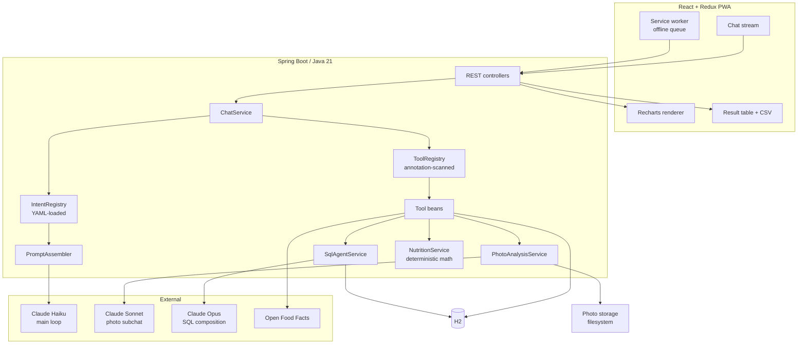
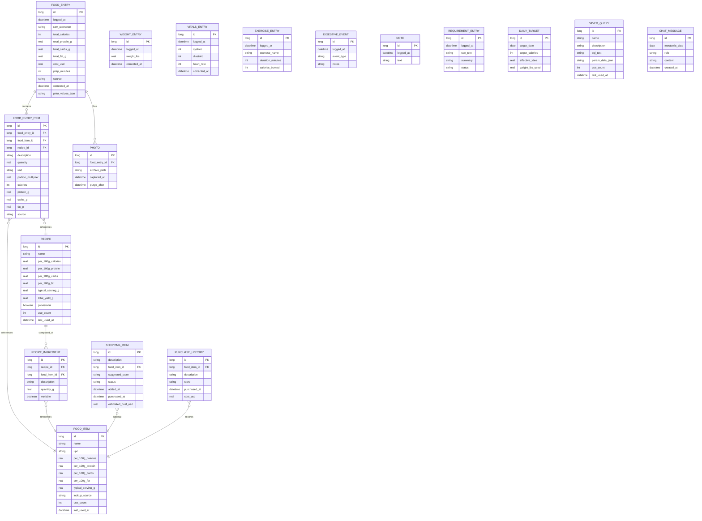
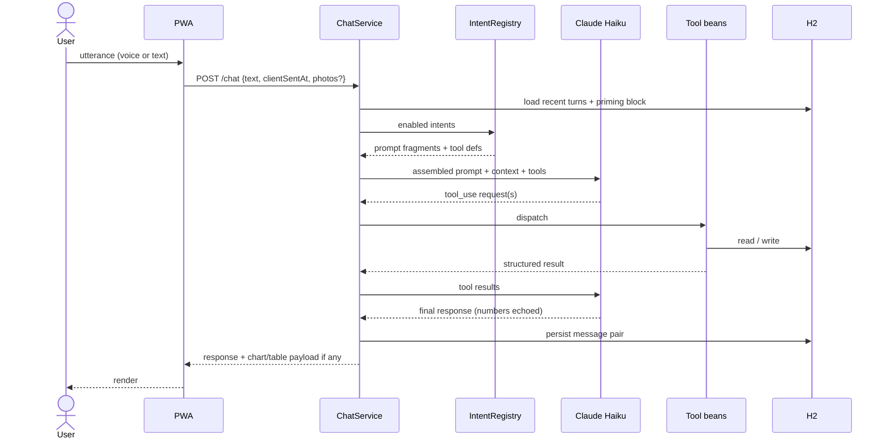
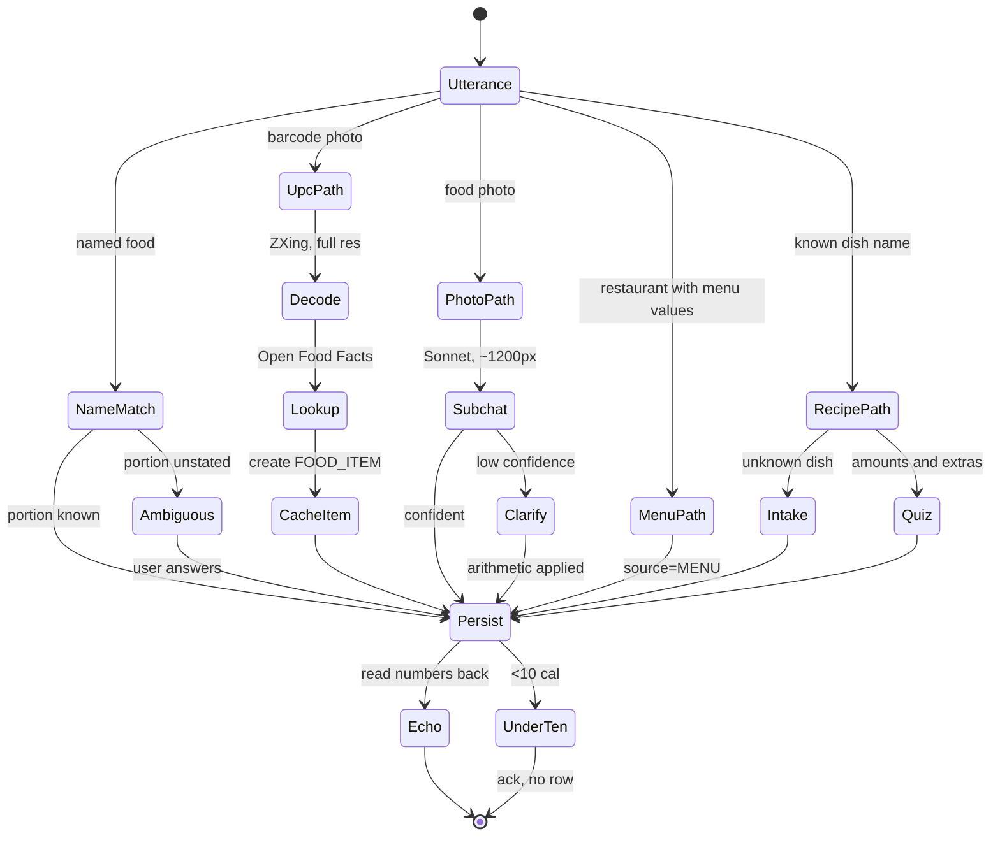
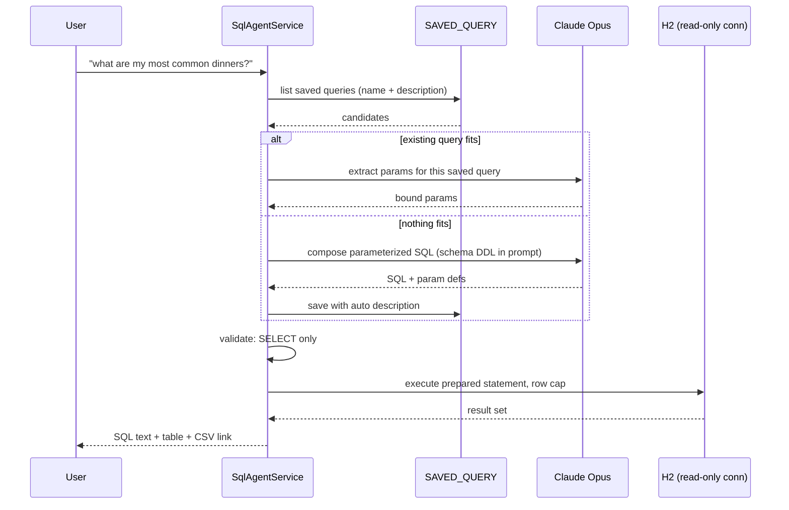
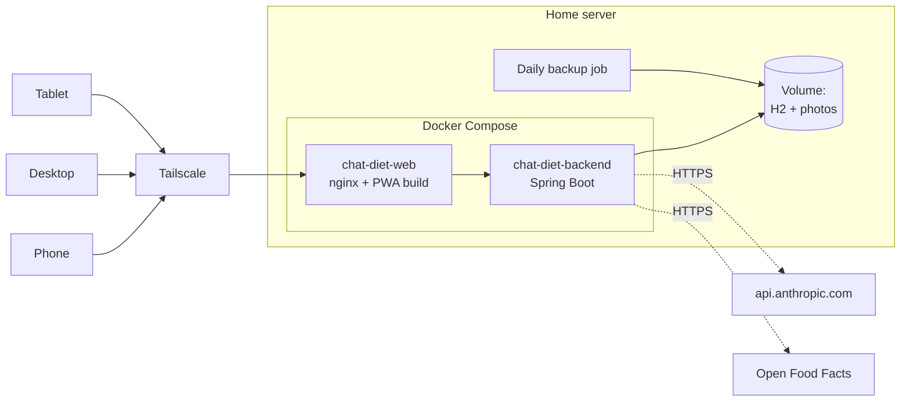

# chat-diet — Design Specification

A single-user conversational app for logging food, weight, vitals, exercise, and
shopping, with nutrition math and ad-hoc analytics. Chat is the entire interface.

Version 1 scope. Written as the implementation brief for Claude Code.

---

## 1. Constraints and principles

| Constraint | Value |
|---|---|
| Users | Exactly one (the owner). No auth beyond network isolation. |
| Access | Tailscale on home network. No public exposure. |
| Deployment | Docker Compose on a home server. |
| Backend | Java 21 on Spring Boot, Spring AI for Anthropic. |
| Frontend | React + Redux PWA, light mode, Recharts. |
| Database | H2 (embedded, file-mode), Liquibase-managed schema. |
| Build | Gradle. Monorepo (backend + frontend). |
| LLM | Claude API only. No local models. |
| API budget | Under $10/month. This is a hard design driver. |
| Units | Imperial (lbs, oz, cups). |
| Time | Local time only. No timezone handling. |

### Java 21 conventions

| Feature | Where |
|---|---|
| Records | Tool request/response DTOs, `IntentDefinition`, chart series, the photo subchat's structured return. **Not JPA entities** — those need a no-arg constructor and mutable fields, so they stay classes. |
| Sealed interfaces + pattern matching | `ToolResult` variants, food-source variants. Exhaustive `switch` over enum-plus-if-chains. |
| Text blocks | Prompt fragments, base system prompt, generated DDL block. |
| Streams | Nutrition aggregation, daily bucketing, chart series computation. |
| `var` | Locals where the right-hand side makes the type obvious. |

Avoid Lombok. Records cover most of what it was used for, and the annotation
processor is one more thing to break.

### Behavioral principles

These are not features. They constrain every response the app produces.

1. **The app is not a nanny.** It never volunteers commentary on data — not
   out-of-range vitals, not calorie progress, not food choices. It answers what
   is asked and logs what it is told.
2. **Echo every number.** Any numeric value persisted is read back in the
   response so transcription errors are visible immediately.
3. **Save immediately, correct after.** No confirmation gate before writing.
   The only exception is genuinely ambiguous input where a missing value would
   make the estimate meaningless (unstated bread on a sandwich, unclear portion
   in a photo).
4. **Corrections must be linguistically marked.** "The correct BP is 156 over
   65", "make that two slices". A bare number is *always* a new entry, never
   inferred as a correction.
5. **Target ~80% nutrient accuracy.** The scale is ground truth; the food log
   is a noisy estimator. Drift is expected and self-corrects at weigh-in.
6. **Sub-10-calorie items are not logged.** Black tea, water. Brief
   acknowledgement, no row written.

---

## 2. Architecture

Version 1 is a **single agent with a tool belt**, not an orchestrator with
sub-agents. The intent registry below is the extension seam: v2 promotes intent
groups to specialist agents without restructuring anything.



### Model tiering

Cost discipline lives here.

| Model | Used for | Frequency |
|---|---|---|
| Haiku | Main chat loop, all routine logging | Every turn |
| Sonnet | Photo analysis subchat (isolated) | Per photo |
| Opus | SQL composition from natural language | Rare (see §8) |

---

## 3. Data model



### Notes on the model

- **`source` enum** on entries and items: `UPC`, `MENU`, `PHOTO_ESTIMATE`,
  `RECIPE`, `MANUAL`. This is how trust level is tracked without cluttering the
  UI with confidence ratings.
- **`FOOD_ENTRY_ITEM.portion_multiplier`** handles "half a plate", "half
  serving" against a known full-serving value.
- **`RECIPE.provisional`** marks a recipe created from a rough estimate before
  real ingredient details were available. Refining it clears the flag.
  Refinement applies to future logs only — past entries are never recalculated.
- **`DAILY_TARGET`** stores the computed target *as of that day*, so historical
  charts show what the target actually was rather than retroactively applying
  today's. Required because the target is dynamic.
- **Corrections** are in-place updates with `corrected_at` plus
  `prior_values_json` as an audit trail. Not delete-and-reinsert.
- **No `clothing_state` on weight entries.** Considered and rejected: clothing
  variance (~2 lb) is smaller than time-of-day variance (~3 lb) and both wash
  out over the trend. The timestamp is the time-of-day metadata.

### Day boundary

Daily totals roll over at a **configurable hour, default 04:00**
(`chat-diet.day-rollover-hour`) — not calendar midnight. Late-night eating counts
toward the prior day.

The metabolic day is **also the conversation boundary** — there is no separate
session concept. An earlier design kept the two independent so conversational
scope could outlive a day, but that required a manual "New Session" button whose
real failure mode was forgetting to press it. Making the day *be* the session
removes the button and the failure mode together.

---

## 4. Intent registry

Intents are **data, not code**. Loaded from YAML in the repo at startup.

```java
public record IntentDefinition(
        String name,
        String description,
        List<String> toolNames,
        String promptFragment,
        boolean enabled
) {}
```

Loaded with Jackson's YAML factory into a `List<IntentDefinition>`. Records
deserialize cleanly with `jackson-databind` 2.12+ — no builder needed.

The system prompt is **assembled, not hand-written**:

```
[base persona + behavioral principles from §1]
+ [current date, time, day-rollover hour]
+ for each enabled intent: promptFragment
+ [tool definitions: union of enabled intents' toolNames]
```

Adding an intent is one YAML block plus any new tool beans. Zero edits to
existing intents, to the base prompt, or to `ChatService`.

**Keep prompt fragments to 2–4 sentences.** The failure mode of this design is
an assembled prompt that bloats and self-contradicts as intents multiply.

### v1 intents

| Intent | Purpose |
|---|---|
| `log_food` | Food entries: named, UPC, photo, recipe-based, menu-sourced |
| `log_weight` | Weight entries |
| `log_vitals` | BP / heart rate |
| `log_exercise` | Exercise by name |
| `log_digestive_event` | Reflux, diarrhea, etc. |
| `save_note` | Freeform timestamped notes-to-self |
| `capture_requirement` | Feature requests about the app itself |
| `manage_shopping` | Add / list / mark purchased |
| `recipe_intake` | Onboard an unknown dish; edit existing recipes |
| `correct_entry` | Marked corrections to any recent entry |
| `query_data` | Summaries, totals, fasting duration |
| `show_chart` | Chart requests with flexible time frames |
| `run_sql` | Natural-language → SQL → result table |

### Tool discovery

```java
public record SaveRequirementRequest(String rawText, String summary) {}

public sealed interface ToolResult {
    record Success(String message, Object payload) implements ToolResult {}
    record NeedsClarification(String question, Object partial) implements ToolResult {}
    record NotFound(String what) implements ToolResult {}
}

@Component
@IntentTool(name = "save_requirement", intents = {"capture_requirement"})
public class SaveRequirementTool implements Function<SaveRequirementRequest, ToolResult> {
    @Override
    public ToolResult apply(SaveRequirementRequest req) {
        // ...
    }
}
```

`ToolResult` as a sealed interface gives exhaustive pattern matching in
`ChatService` when marshalling results back to the model:

```java
String rendered = switch (result) {
    case ToolResult.Success s          -> s.message();
    case ToolResult.NeedsClarification c -> c.question();
    case ToolResult.NotFound n         -> "No match for " + n.what();
};
```

Component scan + annotation means the registry discovers tools rather than
maintaining a manual mapping. New tool = new class.

---

## 5. Chat lifecycle



### Daily virtual sessions

- Sessions are **implicit**: one per metabolic day, created lazily on the day's
  first message. No button, no timeout, no explicit end. Pending conversational
  context (fridge inventory, "I'm about to eat X") survives naturally within the
  day.
- All channels — PWA, desktop, voice — share the same daily conversation, so the
  thread follows the user across devices rather than per tab.
- A turn is filed under the day it was **composed**, not the day it arrived, so a
  message queued offline before the rollover stays with its own day.
- The model is replayed the **last 10 messages** of the current metabolic day.
  `GET /api/chat/history` returns the whole day for display, so reloading or
  opening another device restores the visible transcript. Chart, SQL-table, and
  photo attachments are not persisted, so a restored transcript is text-only —
  the prose reply still carries the numbers.
- **The DB is the real memory.** Chat context stays short; recall of earlier
  facts ("same as breakfast") happens through DB-reading tools, not by keeping
  long transcripts in context. This is the primary cost control.
- Priming block on the day's first turn: current weight and trend, today's
  running total, any due reminders (e.g. BP not logged twice this week).
  Reminders are chat-only — no push notifications, no ntfy.

### Offline

Service worker queues writes when the backend is unreachable and replays them
on reconnect. Log entries carry client-side timestamps so queued entries land
at the time they happened, not the time they synced.

---

## 6. Food logging paths



### Photo pipeline

Three distinct resolutions. This matters.

| Purpose | Resolution | Notes |
|---|---|---|
| Barcode decode | Full camera resolution | ZXing server-side. Downscaling destroys barcode density. No LLM. |
| Vision analysis | ~1100–1500px longest edge | Anthropic scales internally anyway; larger costs tokens without buying accuracy. ~1,600 tokens/image. |
| Archive | 320×480 | Enough to eyeball "what did I eat Tuesday". Purged at 90 days. |

**The Sonnet subchat is isolated and single-shot.** It returns structured
uncertainty and terminates:

```json
{
  "items": [{"description": "sausage", "quantity": 3, "unit": "link"}],
  "calories": 640,
  "protein_g": 28, "carbs_g": 34, "fat_g": 42,
  "confidence": "low",
  "question": "Two sausages or three?"
}
```

The main Haiku agent asks the follow-up and applies the answer **arithmetically**.
The image never re-enters any context. Only computed values cross back.

Cost note: ~2¢ per photo analysis. Ten photos a day is roughly $6/month — most
of the budget. If it runs hot, the lever is barcode-scanning packaged foods
(free and more accurate) rather than downgrading the model.

### Recipes

Stored as **per-100g nutrition plus a typical serving weight**. Never
per-serving only.

**Intake** triggers automatically when an unknown dish is named, or explicitly
on "new recipe". Granularity is whatever is available:

- *Best:* pot-level ingredients + **total pot weight**. Yields well-determined
  per-100g values.
- *Fallback:* reference composition ratios anchored to a weighed serving.
  Mark `provisional = true`.

Do **not** attempt to back out ingredient quantities from serving weight plus an
ingredient list alone — that system is underdetermined. A 400 g bowl of chili
could be 25% or 45% ground beef, a ~200 calorie difference. Ask for pot-level
detail or accept the provisional flag.

Intake behavior:
- Prompt to weigh the serving on first log of a new dish.
- Ask a few clarifying questions on **high-impact** details only (ground beef
  leanness, canned vs. dry beans). Not exhaustive interrogation.
- If details aren't available, log a rough estimate now and refine later.
  Refinement is forward-only.
- No confidence ratings surfaced to the user.

Reuse behavior:
- Fuzzy name matching with a confirming question when unsure ("did you mean
  Fleur's chili?").
- Saying "I'm making a turkey sandwich" quizzes on amounts and extras rather
  than requiring all ingredients re-spoken. `RECIPE_INGREDIENT.variable` marks
  which ingredients to ask about; fixed ones are assumed.
- Re-verify only when the user says a batch seems different.
- Prompt to delete stale recipes (logged once, never again).
- Restaurant/takeout dishes are ordinary named recipes. No special "my usual"
  concept.
- Do **not** ask about toppings, sides, or second helpings. The user will say.

---

## 7. Nutrition math

All deterministic. **Implemented as Java services and exposed as tools — never
performed by the model.** An LLM doing arithmetic is a defect.

### BMR / TDEE

Mifflin-St Jeor for BMR. Activity multiplier derived from logged exercise for
that day rather than a fixed lifestyle factor. Exercise calorie burn feeds the
daily deficit.

### Adaptive target

The scale is authoritative; the food log is an estimator. When actual weight
change diverges from deficit-predicted change, **adjust effective TDEE** — do
not treat the weigh-in as noise.

```
predicted_change = Σ(intake − TDEE) / 3500
actual_change    = latest_weight − prior_weight
error            = actual_change − predicted_change
effective_TDEE  += k · error · 3500 / days_elapsed
```

Damp `k` (start ~0.3). Weigh-ins are irregular, so the correction signal is
sparse and the loop will oscillate if driven hard.

Write each day's computed target to `DAILY_TARGET` so history is preserved.

### Projection

Goal-date projection uses the deficit model, not a linear fit on weigh-ins
alone. Report in pounds alongside calories wherever a surplus or deficit is
shown — `1,500 cal ≈ 0.4 lb` reads very differently from `1,500 CALORIE
SURPLUS`, and the smaller framing is the accurate one.

No plateau or stall flagging. Trend line only.

### Fasting

Window auto-derived from first and last logged food. Answerable on demand ("how
long since I ate"). Queryable historically. **No fasting recommendations, no
compensation planning, no recovery plans** — the user manually adjusts based on
weight feedback.

---

## 8. SQL agent

Replaces essentially all read-only analytics UI. "Favorite dinners" is a query,
not a screen.



### Non-negotiables

- **Read-only enforced at the connection.** Open a second H2 connection with
  `ACCESS_MODE_DATA=r` (e.g. `jdbc:h2:file:./data/chat-diet;ACCESS_MODE_DATA=r`).
  Add a validator rejecting anything but `SELECT` as a second layer. Both are
  cheap; neither alone is sufficient.
- **Always display the generated SQL.** The user is a 40-year engineer and will
  spot a wrong join faster than a wrong number. This is the entire safety model.
- **Row cap** (default 500) with "showing first N". CSV export carries the full
  result set.
- **Query timeout.** Bound it even though a personal DB won't hang long.
- **Parameterized SQL, not literals.** `WHERE logged_at >= ?`, not a baked-in
  date. This is what makes queries reusable across time frames.

### Schema DDL in prompt

Generate the DDL block **from the Liquibase-managed schema at build time**. Do
not maintain it by hand — it will drift and the agent will write queries against
columns that no longer exist.

### Why Opus is affordable here

Reuse collapses the expensive path. After warm-up, composition happens a handful
of times a week; the common case is matching a saved query and extracting
parameters, which Haiku could arguably do. The saved-query library becomes the
user's accreting analytics vocabulary, and it exports with the DB.

---

## 9. Charts

Backend computes **all** series — buckets, totals, target values. Frontend
renders only.

`show_chart` tool arguments:

```java
public enum ChartMetric { CALORIES, MACROS, WEIGHT, DEFICIT, COST }
public enum Granularity { HOUR, DAY, WEEK, MONTH }

public record ChartRequest(
        ChartMetric metric,
        LocalDate from,
        LocalDate to,
        Granularity granularity,
        boolean includeGoal,
        boolean cumulative
) {}

public record SeriesPoint(Instant at, double value, Double target) {}
public record ChartSeries(String label, List<SeriesPoint> points) {}
```

**Period parsing is the model's job.** Give it the current date; let it fill
`from`, `to`, and `granularity` from "today", "this week", "last 3 months",
"since June". Expected defaults:

| Utterance | Range | Granularity |
|---|---|---|
| today | today | HOUR, cumulative |
| this week | Mon–today | DAY |
| last month | prior calendar month | DAY |
| last 3 months | 90d back | WEEK |
| this year | Jan 1–today | MONTH |

**Intraday charts are cumulative against target**, not per-hour bars — hourly
buckets produce a step function that reads poorly.

Goal overlay is a **time-varying series** pulled from `DAILY_TARGET`, not a flat
reference line, because the target is dynamic.

Charts render inline in the chat stream. Shown on request only, never
volunteered. No commentary on what a chart shows.

---

## 10. Frontend

React + Redux PWA. Chat is the whole interface — no dashboard, no entry list, no
recipe browser. Those were considered and cut; the SQL agent covers read-only
needs and corrections happen conversationally.

Components:

- **Chat stream** — messages, inline Recharts, inline result tables with CSV
  download
- **Push-to-talk** — Web Speech API for input; TTS output as an optional toggle
- **Camera / file input** — `<input type="file" capture>`, multiple photos per
  entry
- **Service worker** — offline queue with replay

---

## 11. Deployment



- Two services. No database container — H2 lives on a mounted volume as a
  single `.mv.db` file.
- **Daily automatic backup** of the H2 database file plus the photo directory.
- **Export command** producing one archive: full H2 database file + photos.
- **Photo purge job** — hard-delete photos past 90 days. Permanent, no archive
  tier.
- Anthropic API key via environment variable, not committed.

---

## 12. Build order

Each phase should end with something usable. Do not build the whole data model
before the first working chat turn.

**Phase 1 — skeleton.** Gradle monorepo, Spring Boot + Java 21,
H2 + Liquibase, Spring AI wired to Haiku, minimal PWA chat that round-trips
text. One tool: `save_note`. Prove the loop.

**Phase 2 — intent registry.** `IntentDefinition`, YAML loading,
`PromptAssembler`, `@IntentTool` annotation scanning. Migrate `save_note` onto
it. Write the **routing test suite** now — utterance in, expected tool out.
This suite is what catches regressions when a new intent's recognition cues
overlap an existing one's, and it earns its keep from intent #2 onward.

**Phase 3 — core logging.** `log_food` (named foods only), `log_weight`,
`log_vitals`, `log_exercise`, `log_digestive_event`, `capture_requirement`.
Echo-back and correction handling. Day-rollover config.

**Phase 4 — nutrition math.** `NutritionService`, BMR/TDEE, adaptive target,
`DAILY_TARGET` history, projections, fasting window.

**Phase 5 — UPC and Open Food Facts.** ZXing decode, lookup, `FOOD_ITEM` cache,
frequent-food auto-matching.

**Phase 6 — photo pipeline.** Three-resolution handling, Sonnet subchat,
structured-uncertainty return, archive + purge job.

**Phase 7 — recipes.** Intake subflow, per-100g storage, provisional flag,
fuzzy matching, variable-ingredient quiz, stale-recipe prompts.

**Phase 8 — shopping.** Add/confirm flow, store suggestion from
`PURCHASE_HISTORY`, cost tracking.

**Phase 9 — charts.** Backend series computation, Recharts rendering, period
parsing.

**Phase 10 — SQL agent.** Read-only connection, validator, Opus composition,
`SAVED_QUERY` reuse, build-time DDL generation, CSV export.

**Phase 11 — offline and polish.** Service worker queue, TTS toggle, session
size warning (since removed with explicit sessions), daily backup, export
command.

---

## 13. Deferred to v2

Recorded so they aren't rediscovered as new ideas.

- **Agent registry / orchestrator.** Promote intent groups to specialist agents
  with their own prompts and scoped toolsets. `IntentDefinition` gains `model`,
  and the split becomes config. Deferred because 6 agents means 3+ API round
  trips per utterance — latency and cost that v1 doesn't need.
- **Alexa skill** — separate front end against the same API.
- **Wearable integration** — Apple Health, Fitbit.
- **Receipt-photo parsing** for per-item costs.
- **Habit baseline** — a standing daily calorie allowance for sub-threshold
  items (tea additions, etc.) if invisible drift ever becomes annoying.
- **Local LLM** — evaluated and rejected. Modest home-server hardware limits
  practical models to 3–8B, where tool-calling reliability is inconsistent
  enough that the Claude fallback path would fire constantly.

---

## Appendix: rejected designs and why

Documented to prevent relitigation.

| Rejected | Reason |
|---|---|
| Postgres | H2 is sufficient and backs up as one file. |
| SQLite | Spring Data JDBC's SQL-generation layer requires a registered `Dialect`; SQLite isn't one of the built-in ones (only H2, HSQL, MySQL/MariaDB, PostgreSQL, SQL Server, DB2, Oracle) and its JDBC driver also has real quirks with Hibernate (`AUTOINCREMENT` requires the literal type `INTEGER`, and its `getTimestamp()` doesn't round-trip Hibernate's default numeric datetime binding). H2 file-mode keeps the single-file simplicity SQLite offered without either problem. |
| Local LLM (Ollama) | Hardware limits reliability below usefulness. |
| Six agents in v1 | Latency and cost stacking; no benefit yet. |
| Custom UI screens | Chat plus the SQL agent covers it. |
| Push notifications / ntfy | Leaks to third-party relays; chat reminders suffice. |
| Clothing-weight calibration | Smaller than time-of-day noise; both wash out. |
| Recovery / compensation planning | User adjusts manually from weight feedback. |
| Confidence ratings in UI | Clutter. `source` field carries it internally. |
| Volume-from-photo estimation | Fill depth is unjudgeable from an angle; weight is better. |
| Density/water reasoning chain | Unnecessary once the serving is weighed. |
| Time-window correction inference | Would silently eat a legitimate re-reading. |
| Live subchat for photo clarification | Second image pass costs tokens for no accuracy gain. |
