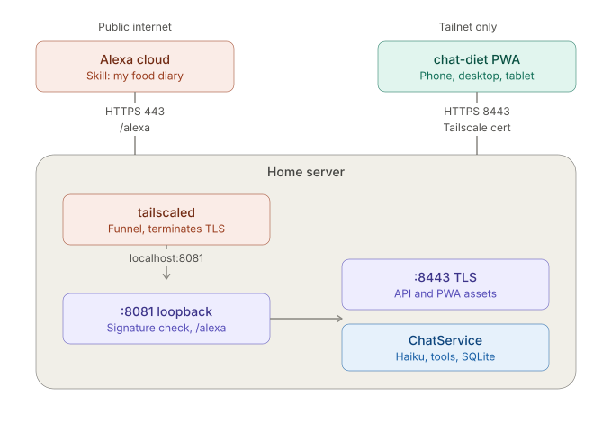

# Alexa Skill for chat-diet

<!-- TOC -->
* [Alexa Skill for chat-diet](#alexa-skill-for-chat-diet)
  * [Context](#context)
    * [Decisions (superseding the original draft)](#decisions-superseding-the-original-draft)
  * [Status](#status)
  * [A. Interaction model (done — recorded for reference)](#a-interaction-model-done--recorded-for-reference)
    * [Why three intents and not one catch-all](#why-three-intents-and-not-one-catch-all)
    * [Why `AMAZON.SearchQuery` and not typed slots](#why-amazonsearchquery-and-not-typed-slots)
    * [Homophone samples](#homophone-samples)
    * [`AMAZON.FallbackIntent` is load-bearing](#amazonfallbackintent-is-load-bearing)
  * [B. Backend changes (`backend/`)](#b-backend-changes-backend)
    * [B1. Port move and second connector](#b1-port-move-and-second-connector)
    * [B2. Alexa controller and signature verification](#b2-alexa-controller-and-signature-verification)
    * [B3. Request handling](#b3-request-handling)
    * [B4. Voice channel](#b4-voice-channel)
    * [B5. Latency](#b5-latency)
    * [B6. Response shaping](#b6-response-shaping)
  * [C. Transcription risk](#c-transcription-risk)
  * [D. Build order](#d-build-order)
  * [E. Verification](#e-verification)
  * [Critical files](#critical-files)
<!-- TOC -->

## Context

chat-diet is a personal, single-user diet/weight/vitals tracker whose primary
interface is a chat box (`POST /api/chat`, backed by an LLM with 19 tools).
Its chat responses are already close to voice-ready (short, spoken-style
sentences, every number echoed) except for two tools (`show_chart`,
`run_sql`) whose whole design assumes a screen.

The goal: log hands-free. Three utterances, nothing else:

```
Alexa, tell my food diary i ate 142 grams of chicken breast
Alexa, tell my food diary i weight two thirteen point four
Alexa, tell my food diary note that i skipped lunch
```

Everything else — queries, charts, corrections — stays in the PWA.

### Decisions (superseding the original draft)

This plan was originally written around a Node Lambda holding a shared
secret, with `tailscale funnel` exposing the whole backend. `SPEC.md` §1/§11
and the Appendix settled on a different shape. What follows matches the spec.

| Decision | Value | Why the earlier plan was dropped |
|---|---|---|
| Hosting | Direct HTTPS endpoint on the Spring backend | Lambda needs a Tailscale client inside it: 2–4s cold start against an 8s budget, plus an AWS dependency the project doesn't otherwise have |
| Auth | Alexa request-signature verification on `/alexa` | A shared `X-Api-Key` header is weaker than the signature scheme Amazon already mandates, and would have meant baking a secret into the PWA build |
| Public surface | `/alexa` only, via Funnel `--set-path` | Funnelling the whole app would expose `/api/*` to the internet |
| Ports | Funnel 443 → `localhost:8081`; app on 8443 | Alexa requires port 443; a port can't be Serve and Funnel at once |
| Interaction model | Three intents, `AMAZON.SearchQuery` slot each | A single `CatchAllIntent` loses the carrier phrase, which is needed to reconstruct the utterance |
| Distribution | Dev-mode, own account, never published | No certification, no privacy policy, no account linking |

Network and certificate configuration is out of scope here — see
`scripts/TAILSCALE-ALEXA-CONFIG.md`.

### Architecture Diagram



---

## Status

**Console side is complete.** Skill created, custom model, provision-your-own
hosting, invocation name `my food diary`, interaction model built (4
successful builds). Endpoint set to HTTPS with the trusted-CA certificate
option.

**Nothing on the Java side exists yet.** The port move to 8443 has not
happened; there is no `/alexa` controller, no verification filter, no voice
channel.

---

## A. Interaction model (done — recorded for reference)

Invocation name: **`my food diary`**. Chosen over "chat diet" and "diet
coach": clean syllable boundaries, no homophone collision, and it reads
correctly in the mid-sentence position (`tell my food diary i ate…`) where a
name ending in a weak syllable blurs into what follows.

```json
{
  "interactionModel": {
    "languageModel": {
      "invocationName": "my food diary",
      "intents": [
        { "name": "AMAZON.CancelIntent", "samples": [] },
        { "name": "AMAZON.HelpIntent", "samples": [] },
        { "name": "AMAZON.StopIntent", "samples": [] },
        { "name": "AMAZON.FallbackIntent", "samples": [] },
        {
          "name": "AteIntent",
          "slots": [{ "name": "text", "type": "AMAZON.SearchQuery" }],
          "samples": ["i ate {text}", "i eight {text}", "ate {text}"]
        },
        {
          "name": "NoteIntent",
          "slots": [{ "name": "text", "type": "AMAZON.SearchQuery" }],
          "samples": ["note that {text}", "note {text}"]
        },
        {
          "name": "WeightIntent",
          "slots": [{ "name": "text", "type": "AMAZON.SearchQuery" }],
          "samples": ["i weight {text}", "i wait {text}",
                      "i weigh {text}", "weight {text}"]
        }
      ],
      "types": []
    }
  }
}
```

### Why three intents and not one catch-all

Alexa consumes the carrier phrase. For "i ate 142 grams of chicken", the slot
value is `142 grams of chicken` — not the full utterance — and the request
does not say which sample matched. The **intent name is the only surviving
record of the carrier**, and it's needed to rebuild the string `ChatService`
expects:

```java
var utterance = switch (intentName) {
    case "AteIntent"    -> "I ate " + text;
    case "NoteIntent"   -> "Note that " + text;
    case "WeightIntent" -> "Weight " + text;
    default -> throw new IllegalArgumentException(intentName);
};
```

These are the same strings the PWA quick-entry buttons prefill
(`MessageInput.tsx`), so voice and touch produce identical input to the chat
loop.

### Why `AMAZON.SearchQuery` and not typed slots

Structured slots (quantity / unit / food) would fight Alexa's NLU forever on
"142 grams of chicken breast". The greedy slot hands the whole phrase to
Haiku, which already parses exactly that. **The interaction model does
routing only; all parsing stays in `ChatService`.**

Corollary for weight: `AMAZON.NUMBER` was rejected. It has no notion of a
plausible body weight and may silently return `2134` for "two thirteen point
four". Haiku won't. Routing weight through the chat loop also keeps
behavioral principle #4 (corrections must be linguistically marked) in one
place — the assembled system prompt — rather than reimplemented in Java.

### Homophone samples

`i eight`, `i wait` are ASR insurance, not phrasing options. Discipline
governs what gets *said*; these absorb what Alexa *hears*.

### `AMAZON.FallbackIntent` is load-bearing

Not included by default; added deliberately. Without it, an unrecognized
utterance still resolves to whichever intent scores least badly, and
`AMAZON.SearchQuery` is greedy enough to win. That's a silent wrong write to
`FOOD_ENTRY`.

Watch for the inverse failure: if fallback *never* fires in a month of daily
use, it's losing to the three intents and phantom entries are accumulating.
Check Daily Foods for rows you don't recognize.

---

## B. Backend changes (`backend/`)

### B1. Port move and second connector

Per SPEC §1/§11: app on 8443 (TLS, Tailscale cert, tailnet-only), Alexa on
8081 (plaintext, loopback-only).

- `application.yml` — `server.port: 8443`, add `chat-diet.alexa.port: 8081`.
- A `WebServerFactoryCustomizer<TomcatServletWebServerFactory>` adding a
  second connector bound to `127.0.0.1` on the Alexa port.
- Docker: publish `8443`, and publish the Alexa port as
  `127.0.0.1:8081:8081` so only tailscaled can reach it. Publishing on
  `0.0.0.0` opens it to the LAN.
- A filter rejecting non-`/alexa` paths on 8081 and `/alexa` on 8443. Funnel
  already mounts one path; this is the second layer, so a config typo can't
  expose the API.

**Cutover ordering matters.** Drain the offline queue on every device
*before* changing the port. IndexedDB is origin-scoped and the origin
includes the port, so anything pending at `:443` is stranded — not lost from
SQLite, but unreachable. Then: change port → verify from tailnet → re-install
the PWA on each device (service worker re-registers, bookmarks and
home-screen shortcuts need updating).

No frontend code changes. The original plan's `X-Api-Key` header on
`chatSlice.ts:62/:102` is not needed — the PWA stays unauthenticated on the
tailnet-only port, exactly as today.

### B2. Alexa controller and signature verification

New `backend/src/main/java/com/chatdiet/alexa/` package.

Dependency — verify the current version before pinning:

```groovy
implementation 'com.amazon.ask:ask-sdk-core'
implementation 'com.amazon.ask:ask-sdk-servlet-support'
```

`ask-sdk-servlet-support` carries `SkillRequestSignatureVerifier` and
`SkillRequestTimestampVerifier` under `com.amazon.ask.servlet.verifiers`.
**Do not hand-roll the cert chain validation** — host and path checks on
`SignatureCertChainUrl`, SAN check for `echo-api.amazon.com`, chain of trust,
and signature verification against the *raw* request body all have sharp
edges.

Verification must run before any parsing or dispatch:

1. `Signature-256` / `SignatureCertChainUrl` validation.
2. Timestamp within 150 seconds.
3. `applicationId` matches this skill's ID (`amzn1.ask.skill.<uuid>`).

Any failure → 400, nothing touches the database.

**Read the body once.** The signature is computed over raw bytes; if Spring
has already deserialized to a DTO, re-serializing gives different bytes and
verification fails. Use a `ContentCachingRequestWrapper` or read the raw
stream in the filter and pass it forward.

Cache the downloaded certificate — fetching it per request adds latency to a
budget that has none to spare.

### B3. Request handling

Seven request types:

| Request | Response | `shouldEndSession` |
|---|---|---|
| `LaunchRequest` | "Ready." | `false` |
| `AteIntent` / `NoteIntent` / `WeightIntent` | Tool result, numbers echoed | `false` |
| `AMAZON.HelpIntent` | "Say I ate, I weight, or note that." | `false` |
| `AMAZON.FallbackIntent` | "Sorry?" | `false` |
| `AMAZON.StopIntent` / `AMAZON.CancelIntent` | (silent or "Okay.") | `true` |
| `SessionEndedRequest` | no-op, log only | n/a |

`SessionEndedRequest` is a notification — Alexa ignores speech in the
response.

Set a `reprompt` on every open-session response. Alexa speaks it once after
~8s of silence, then closes after another ~8s.

**Alexa sessions are a mic-open/mic-closed state and nothing more.** The
persistence boundary is the metabolic day (SPEC §3, §5). Session end writes
nothing, clears nothing, and must not leak into `ChatService`.

Session end on error: any handler that fails should say what went wrong and
return `true`. Leaving the mic open on an unhappy path invites a second bad
write.

### B4. Voice channel

`ChatService` builds **one** `ChatClient` at startup from
`PromptAssembler.assemble()` (`ChatService.java:23-29`), so prompt and tools
are fixed for the app's lifetime. Minimal-diff fix: build two.

1. `ChatRequest` (`ChatRequest.java:13`) — add `String channel` (nullable;
   only `"voice"` changes behavior).
2. `PromptAssembler.assemble()` → `assemble(boolean voiceChannel)`. When
   true: exclude the `show_chart` and `run_sql` intents by name before
   building fragments and tool names, and append a voice instruction — no
   screen, speak full numbers aloud, never mention charts or tables, 1–3
   sentences. Keep a no-arg `assemble()` delegating to `assemble(false)`.
3. `ChatService` — build `webChatClient` and `voiceChatClient` at
   construction; add `boolean voiceChannel` to `reply(...)` with the existing
   overload delegating `false`.
4. The Alexa controller passes `true`. `ChatController` is unchanged; the
   multipart photo endpoint is untouched (Alexa can't send photos).

Excluding those two intents also drops their tools from the voice tool
definitions, which shortens the prompt and cuts per-turn cost.

### B5. Latency

Alexa allows roughly 8 seconds. A voice turn is: signature verification →
Haiku call → tool dispatch → possibly an FDC or OFF round trip → second Haiku
call for prose. Realistically 3–6s on the tool path, worse when FDC is slow.
Timeouts will happen.

Two mitigations, both in the endpoint:

- **Skip the second model round trip.** When a log tool returns `Success`,
  template the confirmation from the tool payload rather than sending results
  back to Haiku. The numbers are already in hand: `"Logged. %d calories."`
  This roughly halves the worst path and satisfies principle #2 (echo every
  number) exactly as well as generated prose.
- **Tighten the FDC timeout on the voice channel** (~1.5s) and fall through
  to model estimate rather than blocking.

Progressive Response can speak filler while working. As far as I know it does
**not** extend the 8s deadline — verify before designing around it.

### B6. Response shaping

- SSML `<say-as interpret-as="cardinal">` on calorie and weight figures, so
  234 is spoken "two hundred thirty four" rather than "two three four".
- No chart or table payloads. Excluded at the intent level in B4, but the
  controller should drop any attachment payload defensively.
- Replies under ~15 words.

---

## C. Transcription risk

This is the part most likely to cause silent damage, and it compounds an
existing weakness.

ASR degrades queries in a specific direction: **it strips qualifiers**. "sharp
cheddar" arrives as "cheddar", "extra virgin olive oil" as "olive oil", "Clif
bar" as "cliff bar". Numbers render inconsistently ("142" usually, "one forty
two" sometimes) — Haiku absorbs that fine.

The qualifier stripping is the problem. SPEC §6 documents that
`FoodItemRepository`'s cache lookup and `FdcClient` share a
bidirectional-substring test: query contains candidate, or candidate contains
query. Short queries are substrings of many longer names. "rice" matches a
cached "fried rice"; "egg" matches "egg mcmuffin". The match is accepted, the
per-100g values are scaled, and the row is tagged with the cached item's
`lookup_source` — so a wrong number acquires an `FDC` or `OFF` provenance
label and looks *more* trustworthy than an honest estimate. Nothing in the
echoed response indicates a problem.

Voice makes queries shorter, so it makes this worse.

Note that SPEC §6 already identifies this exact failure for `PORTION_UNIT`
matching — it only accepts a bidirectional-substring match on unit names when
unambiguous, because "cup, sliced" and "cup, mashed" differ by 75g and
picking one would be a silent guess. The same reasoning has not been applied
to the item-name lookup.

**Fix the matcher before wiring `ChatService` to Alexa**, not after. Tracked
separately; not in scope here.

Also out of scope: UPC by voice. Twelve digits read aloud is near-100% error.

---

## D. Build order

1. Fix the cache substring matcher (separate work item, but it gates step 7).
2. Drain offline queues on every device.
3. Move app to 8443; verify from tailnet; re-install PWA everywhere.
4. Second connector on `127.0.0.1:8081`, stub `/alexa` returning a hardcoded
   Alexa response envelope. No `ChatService`, no DB. Verify with local curl.
5. Signature verification filter. Get it rejecting the local curl *before*
   anything is public.
6. Funnel 443 (`TAILSCALE-ALEXA-CONFIG.md`). Verify from off the tailnet —
   phone on cellular, not home wifi. On-tailnet requests resolve directly and
   never touch the relay, so success there proves nothing. A 400 from the
   verification filter is the correct result.
7. Point the ASK console at the endpoint; test the stub from the simulator.
8. Wire the three intents to `ChatService` with `voiceChannel=true`.
9. Templated confirmations (B5) once the round trip works.

Steps 4–6 are each independently verifiable. Don't collapse them.

---

## E. Verification

**Simulator** (Test tab, Development): confirms routing and slot capture
without a device. The JSON Input panel shows the resolved intent and slot
value — the same information the Utterance Profiler gives, if that panel is
being uncooperative.

**Real Echo** — dev-mode skills are automatically available on your own
account's devices, no publishing:

- One-shot: `Alexa, tell my food diary i ate a banana` → logs, echoes the
  number.
- Session: `Alexa, open my food diary` → "Ready." → `i weigh three hundred` →
  logged → `i ate 142 grams of chicken breast` → logged → `stop`. Confirms
  the mic stays open and bare utterances resolve without the invocation name.
- Cross-channel: log on Alexa, then open the PWA and check Chat History for
  the same metabolic day. Both should be in one thread.
- Fallback: say something nonsensical. Should get "Sorry?" and write nothing.
- Rollover: log after midnight but before the configured rollover hour;
  confirm it files under the prior metabolic day.

**Log every Alexa request's intent name and slot value** before
reconstructing the utterance. The first week tells you which samples are dead
weight and whether fallback is firing at a sane rate.

---

## Critical files

- `backend/src/main/java/com/chatdiet/alexa/AlexaController.java` (new)
- `backend/src/main/java/com/chatdiet/alexa/AlexaSignatureFilter.java` (new)
- `backend/src/main/java/com/chatdiet/alexa/AlexaConnectorConfig.java` (new)
- `backend/src/main/java/com/chatdiet/chat/ChatService.java`
- `backend/src/main/java/com/chatdiet/chat/ChatRequest.java`
- `backend/src/main/java/com/chatdiet/intent/PromptAssembler.java`
- `backend/src/main/resources/application.yml` / `.yml.example`
- `scripts/TAILSCALE-ALEXA-CONFIG.md`

No frontend files change.