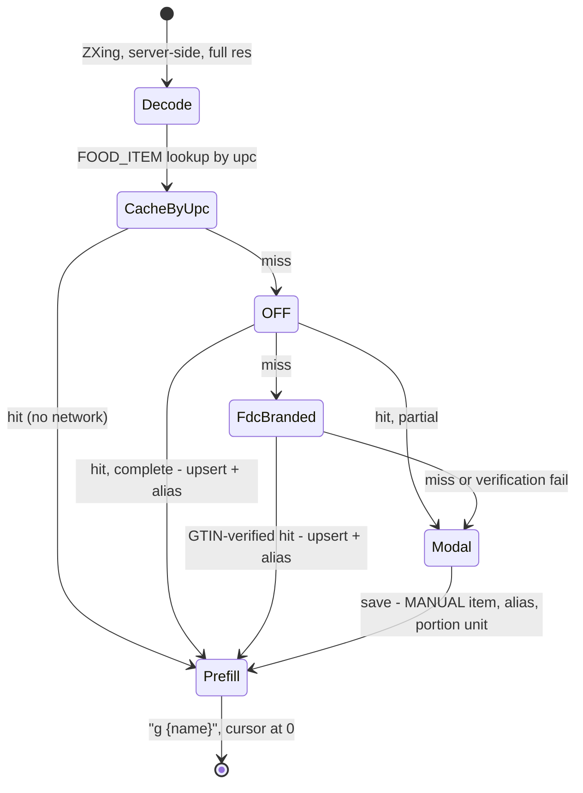

# Fixing the substring problem — food identity, quantity, and multi-item entries

A diff against `SPEC.md`. Covers the food subsystem only: how a food is
identified, how an amount is resolved, how multi-food utterances are stored,
and what the UPC path does when a lookup misses.

Not an incremental patch to the fuzzy matcher. The matcher is removed and
replaced with an alias table plus explicit clarification turns; several
adjacent behaviors change as a consequence.

---

## 0. Why

`FoodItemRepository`'s cache lookup and `FdcClient.search()` both resolve a
food name with a bidirectional-substring test — the query contains the
candidate's name, or vice versa. That is a containment check standing in for a
similarity check. It has no notion of what the extra tokens mean, and the
tokens it discards are usually the ones carrying the calorie delta.

| Shape | Example | Result |
|---|---|---|
| Candidate contains query | `banana` → cached `banana bread` | 3× calories; passes the one-word-longer guard |
| Query contains candidate | `chicken breast` → cached `chicken` | Generic-chicken per-100g scaled to a real weighed amount |
| Qualifier inversion | `yogurt` → `non-fat yogurt`; `milk` → `whole milk` | The distinguishing token is exactly the one containment throws away |

None of these fail loudly. On the weighed-gram path — the dominant path — a
wrong match scales the wrong per-100g values by a real scale reading and writes
a plausible row. Confidence ratings are rejected as clutter (Appendix) and the
echo reads back numbers rather than the resolved item, so there is no signal at
write time and none at read time.

`PORTION_UNIT` matching already gets this right: it refuses an ambiguous
substring hit rather than picking one. The `FOOD_ITEM` matcher has no
equivalent refusal. This spec generalizes `PORTION_UNIT`'s discipline to
identity resolution.

---

## 1. Behavioral principles (§1)

**Remove principle 6** ("Sub-10-calorie items are not logged").

Written when food logging was free-text estimation and the model might
volunteer a row for anything mentioned in passing. Logging is now deliberate —
weighed or scanned — so the threshold fires only on real foods in small
portions (24g of celery: fiber, potassium, and sodium the Micronutrients page
tracks). Water, tea, and diet drinks are excluded by not being entered. It is
also the app's only silent no-op: the reply reads as acknowledgement whether or
not a row was written.

**Add a new principle:**

> **No silent resolution.** Where the app chooses between plausible
> interpretations, or falls back to a lower-quality source, it says which one
> it used. A wrong answer indistinguishable from a right one is worse than a
> question.

Two halves, both load-bearing. The first governs *identity* — the substring
matcher violated it. The second governs *provenance* — §6's "if the FDC key is
unset, the lookup tier is silently skipped" violates it, and so does any reply
that renders an FDC number and a model estimate identically.

Principle 3 ("Save immediately, correct after") still governs *writes*. The app
does not gate a resolved entry behind confirmation. Clarification happens
before there is anything to save.

---

## 2. Decomposition

Three concerns are currently smeared across four tools:

1. **Identity** — which food is this?
2. **Quantity** — how many grams?
3. **Logging** — write the row.

`log_food`, `log_food_by_upc`, and `log_cached_food` each implement all three
via a different identity path, which is why §4 has to explain that
`log_cached_food` and `log_food`'s internal cache pre-check "solve overlapping
but not identical cases."

Identity has four sources (alias, UPC, prior entries, clarification); quantity
has four (stated grams, unit→grams, servings, unresolvable). They combine
freely. A fixed set of end-to-end tools needs ~16 entries or accepts the
current overlap.

Split identity from quantity, keep one logging path:

```
FoodResolver(foodRef)                  → Resolved(FoodItem) | Ambiguous(candidates) | Unknown(candidates)
QuantityResolver(foodItem, amountText) → grams | Unresolvable
```

Both must succeed before a row is written.

---

## 3. Schema

### 3.1 New: `FOOD_ALIAS`

```
FOOD_ALIAS {
    long id PK
    string alias_normalized UNIQUE
    long food_item_id FK
    string source
    datetime created_at
}
```

`source`: `USER` (clarification turn), `OFF`, `FDC`, `MANUAL` (Food Items
save).

Resolution is an exact lookup on `alias_normalized`. No `LIKE`, no substring,
no ranking, no threshold.

Soft-deleting a `FOOD_ITEM` leaves its aliases in place but they stop
resolving; restoring reinstates them. Removing an alias is a Food Items action
(§3.4), never automatic.

### 3.2 Normalization

Normalization is the function turning a typed phrase into a lookup key. Every
transformation it applies is an assertion that two strings mean the same food —
the same judgment the substring matcher made badly. It is safe here only
because it is **symmetric and total**: applied identically to the alias at
write time and the query at read time, with no ranking and no candidate
selection. That safety holds only for genuinely meaning-preserving transforms.

**The complete rule set, in order:**

```
1. NFKC normalize, strip combining marks       crème → creme
2. lowercase                                    Honey Wheat → honey wheat
3. remove ' and ’                               Nature's → natures
4. & → " and "                                  mac & cheese → mac and cheese
5. - _ / → space                                non-fat → non fat
6. strip remaining punctuation                  bananas. → bananas
7. collapse whitespace, trim
8. drop leading article only: a | an | the      a banana → banana
```

Nothing else. Specifically **not**:

| Rejected | Why |
|---|---|
| Stemming / plural folding | `oat` vs `oats`, `green` vs `greens` are different foods. Handled instead by offering the naive singular/plural flip as a clarification candidate (§4.2), confirmed once, aliased forever |
| Preparation-word stripping | `cooked rice` vs `rice` differs ~3× per 100g by water content — a real error on the weighed path. `grilled` vs `fried` differs by the oil |
| Brand-word stripping | `great value smoked ham` → `smoked ham` merges a specific product into a generic |
| Stop-word removal | `beans with bacon` is not `beans`. The article rule in step 8 is deliberately narrow: leading position only |

Step ordering matters. Hyphens (5) before articles (8), and articles only at
string start, so `half and half` survives intact.

An over-aggressive normalizer is a fuzzy matcher wearing a different hat. Bias
toward under-normalizing: an unnecessary clarification turn costs seconds, a
silent merge costs a wrong number nobody sees.

### 3.3 No seeding

Aliases are **not** backfilled from existing `FOOD_ITEM` names. They accrete
from clarification turns, scans, and Food Items saves only.

Seeding is safe in the narrow sense — one alias per item, verbatim, no variant
generation — but it makes rows minted under the broken matcher resolve
silently and permanently. Not seeding means each existing food is looked at
once, by a human, with FDC candidates beside it: a cache audit disguised as a
clarification.

Currently moot in practice — `FOOD_ITEM` holds one row (`orange juice`, created
after the FDC tier shipped). Insert its alias by hand in the Liquibase
changeset. No seeding code.

### 3.4 Alias management

The Food Items page (§10 of `SPEC.md`) gains a per-item **alias list** with add
and remove. A clarification that turns out annoying is fixable in seconds
rather than waiting to be asked again.

### 3.5 `FOOD_ENTRY.entry_group_id`

```sql
ALTER TABLE food_entry ADD COLUMN entry_group_id INTEGER;
UPDATE food_entry SET entry_group_id = id;
CREATE INDEX idx_food_entry_group ON food_entry(entry_group_id);
```

One row per **food**, not per utterance. `raw_utterance` repeats across a
group.

**Flattened, not nested.** The v1 brief proposed a `FOOD_ENTRY_ITEM` child
table; the Appendix records it as never built. Do not revive it. Every current
consumer sums `FOOD_ENTRY` rows — `DailyMacroCacheService`, the Micronutrients
page, Daily Foods, chart series, and every row in `SAVED_QUERY`. A parent/child
split forces each to decide which level to sum, and any that gets it wrong
double-counts silently. Flattening leaves all of them correct and untouched;
there are simply more rows.

It also makes `food_item_id` and `amount_grams` meaningful on every row rather
than only on single-food entries, which is what the repeat path and gram-based
corrections need.

`entry_group_id` is an **undo boundary and a display grouping. It is not a
meal, a dish, or a recipe.** Two scans for one sandwich produce two groups. Do
not let it be promoted into a meal concept.

### 3.6 `FOOD_ENTRY.meal` (deferred)

No meal concept exists; `logged_at` is the only grouping signal. Time-window
bucketing off `chat-diet.day-rollover-hour` covers the repeat path (§7) at zero
schema cost and is wrong whenever eating is off-schedule. If misfires prove
annoying, a nullable `meal` column is a one-column migration and bucketing
becomes its fallback for untagged rows. Not built now.

---

## 4. `log_food`

### 4.1 Signature

```
log_food(items: [{ foodRef: string, amountText: string }])
```

`foodRef` — the food name as spoken.
`amountText` — the amount phrase verbatim: `"142g"`, `"2"`, `"a bowl"`, `""`.

**There is no `amountGrams` field.** §6 records the observed behavior that
Haiku, even when instructed not to, pairs a natural quantity+unit with its own
confident gram guess rather than omitting it to force a real FDC lookup. That
is a schema problem, not a prompting problem: the model fills the field because
the field exists. Removing it fixes the behavior structurally and is what
finally exercises the `PORTION_UNIT` path already built for it.

### 4.2 Resolution

```mermaid
stateDiagram-v2
    [*] --> Normalize
    Normalize --> AliasLookup: exact match on alias_normalized
    AliasLookup --> QuantityResolve: hit
    AliasLookup --> Candidates: miss
    Candidates --> Ambiguous: 2+ plausible cached items
    Candidates --> Unknown: 0-1 cached; FDC candidates only
    Ambiguous --> Clarify
    Unknown --> Clarify
    Clarify --> QuantityResolve: user picks by number
    QuantityResolve --> Persist: grams resolved
    QuantityResolve --> Clarify: unresolvable
    Persist --> Echo
    Echo --> [*]
```



**Two lookups, one exact and one fuzzy, and the distinction is the design.**

*Alias resolution* is exact only — `WHERE alias_normalized = ?`. Hit or miss.
This is the path that writes rows without asking, so it must be incapable of
guessing.

*Candidate generation*, on a miss, is fuzzy and should be: trigram or
Levenshtein similarity against alias and item names, naive singular/plural
flip, token overlap, FDC search. This path writes nothing. It produces a
numbered list.

**The fuzzy tier must never auto-select, at any similarity score.** No
"close enough" shortcut, no threshold above which the app resolves silently.
The moment such a threshold exists it is the substring matcher with a tunable
knob, and it will get tuned upward the first time a clarification is annoying.

Candidate ordering: **cached `FOOD_ITEM` candidates always rank above FDC
candidates.** A local row is one already vetted, and preferring it is what
prevents duplicate items accreting.

### 4.3 Alias write rules

| Outcome | Meaning | Write alias? |
|---|---|---|
| `Unknown` | No plausible cached candidate; the phrase is new | **Yes** |
| `Ambiguous` | Two or more live cached candidates | **No** — resolve for this turn only |

The `Ambiguous` rule matters. If `wheat bread` is ambiguous between a honey
wheat and a whole wheat, writing `wheat bread → Honey Wheat` makes the other
loaf unreachable by that phrase forever — the same silent corruption relocated
from the matcher into the alias table. A genuinely ambiguous phrase is
ambiguous again next week and should ask again. The remedy is to be eight
characters more specific.

Optional "always mean this" affirmative forcing an alias write on an
`Ambiguous`: **not in v1**.

**Do not auto-generate alias variants.** Stripping brand words, dropping sizes,
emitting trailing n-grams from a product name reintroduces the substring bug at
write time, where it is harder to see. One alias per registration event,
verbatim.

### 4.4 Clarification UX

**Numbered list; the user replies with an index.** Works on the Alexa channel;
tappable candidates would not. Show up to 5 candidates plus an explicit
"estimate it" option (§4.7).

### 4.5 Echo the resolution

```
142g chicken breast → Chicken, broilers or fryers, breast, meat only, raw (FDC) — 165 cal
```

Two independent justifications. Both are load-bearing; neither alone should be
allowed to drop the other.

**Identity.** Echoing only `165 cal` gives no way to tell whether the right
item was picked. The resolved name makes a wrong match visible while it is
still free to correct. This is the direct counterpart to the §0 failure.

**Tier.** The pipeline has ordered tiers — alias hit, FDC, OFF, model estimate
— producing numbers of materially different quality, currently rendered
identically. `165 cal` from an FDC Foundation row and `165 cal` invented by
Haiku are the same six characters. Worse, tiers degrade *silently*: per §6, an
unset FDC key skips the lookup tier without a word, so the app can stop using
its best source and keep answering in the same voice.

The tier tag makes this self-monitoring — three consecutive raw vegetables
resolving as `(estimate)` says the FDC tier is down today, rather than that
fact surfacing months later via a manual SQL query. That observability gap is
real whether or not anything is currently broken, and the tag closes it for one
line of output.

### 4.6 Partial batch resolution

Three items, one ambiguous: **write the two that resolved**, return
`NeedsClarification` naming only the third, and log it into the same
`entry_group_id` on the clarifying turn. Do not hold a batch hostage to one
unresolved item.

### 4.7 `MODEL_ESTIMATE`

Weakened deliberately. Today a first mention silently mints a permanent
`FOOD_ITEM` named whatever phrase the model emitted, with invented numbers,
never revisited. Unknown foods now route to a clarification turn, so
`MODEL_ESTIMATE` becomes an option **chosen** from the numbered list rather
than a default never seen.

This is the intended outcome when FDC has nothing — prepared dishes (`chili`,
`lasagna`, `stir fry`) are thin in Foundation/SR Legacy. The list renders with
whatever cached candidates exist plus the estimate option, and the estimate is
picked knowingly.

### 4.8 `log_cached_food`

Fold into `log_food` and delete the tool. Under aliases, "another Clif bar" is
a `foodRef` with a servings-shaped `amountText`; `QuantityResolver` handles
servings via `typical_serving_g`. Keep only if the servings handling turns out
to do something this spec has missed.

---

## 5. FDC lookup

### 5.1 Role change: precision → recall

`FdcClient.search()` was tuned for precision because it picked one match with
nobody to check it — the plausibility test rejected implausible top hits, and
qualifier-count ranking pushed `Bananas, raw` above `Bananas, dehydrated`.
Getting it wrong wrote a bad row silently.

Under aliases, FDC never resolves anything. It generates candidates for a list
a human reads. Getting the *ordering* wrong costs a glance; **missing the right
food entirely** costs a manual `FOOD_ITEM` creation or an accepted estimate.

Therefore: **remove the plausibility rejection.** It guarded the automated
path and is now actively harmful — a "rejected" candidate is still a candidate
worth showing. This also collapses `search()` and `searchCandidates()` into one
method with two callers.

### 5.2 Query construction

Send the **normalized `foodRef`, unmodified.** Not the raw utterance, not
keyword extraction, not a model rephrasing. `24g celery sticks` → `foodRef` is
`celery sticks` → query is `celery sticks`.

No query transformer. Any stripping done here — preparation words, brands,
plurals — is normalization by another name, applied asymmetrically, invisibly,
against a remote index.

| Param | Value | Why |
|---|---|---|
| `dataType` | `["Foundation","SR Legacy"]` | `Branded` is a separate call path (§6.3), never mixed in |
| `pageSize` | 10 | Show ~5; fetch extra so local re-ranking has material |
| `requireAllWords` | `false` | `true` on `celery sticks` returns nothing — FDC has no "sticks". Multi-word user phrasing is normal and FDC descriptions use their own vocabulary |
| `sortBy` | omit | Local re-ranking follows anyway |

### 5.3 Re-ranking

Local, no extra API calls. Retain qualifier-count ranking (built to make an
automated pick less wrong; now makes the list read better). Add:

- Exact match on the description's leading token, before the first comma —
  strong boost. `celery sticks` vs `Celery, raw` hits this.
- Token overlap between query and description.

Cached-items-first ordering (§4.2) is applied at candidate assembly, above
`FdcClient`.

### 5.4 No FNDDS fallback

Do not widen to `Survey (FNDDS)` when Foundation/SR Legacy return nothing.
FNDDS is survey-reported composite data with different provenance and quality;
mixing it into the same numbered list puts two data qualities behind
identical-looking options. If it is ever wanted, it is a labeled tier, not a
silent widener.

### 5.5 No caching needed

One search per unresolved `foodRef`, and unresolved is rare by construction —
every clarification writes an alias preventing the next one. Rate limit is
~1,000/hr against single-digit daily usage. (The old fuzzy path hit FDC on
every cache miss, forever; the new one hits it once per phrase, ever.)

### 5.6 Nutrient-ID mapping

**Always fetch the detail endpoint before writing a `FOOD_ITEM`.** Search
results and detail nest nutrients differently — search returns a flatter form
with `nutrientId` on the entry, detail nests under a `nutrient` object. Code
written against one reads `undefined` against the other and maps it to null,
silently. One parser, one shape. The detail call is already being made for
`fetchPortions`, so this costs nothing.

Starting map, **to be verified empirically** against real Foundation, SR
Legacy, and Branded records before implementation:

| App field | FDC ID | Name |
|---|---|---|
| calories | 1008 | Energy (kcal) |
| protein | 1003 | Protein |
| fat | 1004 | Total lipid (fat) |
| carbs | 1005 | Carbohydrate, by difference |
| fiber | 1079 | Fiber, total dietary |
| sodium_mg | 1093 | Sodium, Na |
| saturated_fat | 1258 | Fatty acids, total saturated |
| cholesterol_mg | 1253 | Cholesterol |
| potassium_mg | 1092 | Potassium, K |
| sugar | **unresolved** | 2000 (`Sugars, total including NLEA`) and 1063 (`Sugars, Total NLEA`) both appear; which one varies by data type and record age |

Four rules the mapper must follow:

1. **Match on ID, never on name.** A food can carry 1008 (kcal), 1062 (kJ), and
   in Foundation records 2047/2048 (Atwater general/specific, also kcal).
   Scanning for the first nutrient whose name starts with "Energy" returns
   whichever ordering FDC felt like, in whatever unit.
2. **Absent ≠ zero.** A missing nutrient means *not reported*. Defaulting to
   0.0 makes an unknown indistinguishable from a real zero, silently
   under-reporting the Micronutrients %DV bars. The columns are nullable — map
   absent → null, and let the page distinguish. A null is also a visible gap
   fixable from a label on the Food Items page.
3. **Assert units, don't coerce.** `g` for macros, `mg` for sodium/potassium/
   cholesterol, `kcal` for 1008. Throw on mismatch. If FDC changes a unit, a
   loud failure beats a value off by 1000×.
4. **Branded reports twice.** `foodNutrients` is per-100g; `labelNutrients` is
   per-serving off the package. `FOOD_ITEM` is per-100g, so read
   `foodNutrients` and ignore `labelNutrients` — except `servingSize`/
   `servingSizeUnit`, which populate `typical_serving_g` and a `PORTION_UNIT`
   row. **Watch for `servingSizeUnit: ml`** on liquids; storing an ml figure in
   a grams column produces plausible wrong numbers. (Orange juice — the one
   currently cached item — is exactly this case.)

Implement as a single `FdcNutrientMapper` consuming the detail shape only.

---

## 6. UPC path

### 6.1 Flow



### 6.2 Prefill

Identity resolves **before** the message is composed. The decode endpoint
returns the resolved product name; the client prefills `MessageInput` with
`"g {name}"`, cursor at position 0. The user types the scale reading and sends.

This routes through normal `log_food` with a `foodRef` guaranteed to be an
exact alias hit — no fuzzy matching — and the resolved name is visible *before*
the write rather than echoed after it. A wrong barcode match becomes obvious
while it is still free to fix.

`log_food_by_upc` survives for typed and spoken UPCs, where there is no prefill
opportunity. It takes `amountGrams` and routes to the same resolver.

### 6.3 FDC Branded as second-tier UPC lookup

FDC's Branded data type is manufacturer-submitted label data (GS1/1WorldSync)
with better US store-brand coverage and no crowdsourced transcription errors.

It goes **second**, not first, because it has no barcode endpoint: a UPC lookup
is a fuzzy full-text search returning hundreds of thousands of hits for an
unknown barcode, with position zero carrying a different GTIN than the one
queried. That is the substring problem in a new location with the same
signature.

**Mandatory:** accept a hit only if its `gtinUpc` equals the queried barcode,
both with leading zeros stripped. Otherwise treat as a miss. No ranking
heuristic, no fallback to position zero.

`FdcClient` therefore serves two tiers with different rules — Foundation/SR
Legacy for named raw foods (§5, fuzzy, re-ranked) and Branded for UPC fallback
(exact GTIN verification, no fuzzy component by design). **These do not share a
code path.**

OFF stays first because `/api/v2/product/{barcode}` is a deterministic yes/no
with no fuzzy layer to defend against. Determinism on the identity path is
worth more here than marginal data quality.

### 6.4 Manual-entry modal

Terminus for **every** UPC miss and every partial result. Standing at the
counter with the package, the label beats both databases, it is already in
per-serving form, and the cost is one-time per product.

**Reuse the existing Food Items edit modal** in a "new item, UPC prebound"
mode. Do not build a second nutrition-entry form — two places to fix a bug, two
places for the scaling math to drift. Prefill `upc` from the decode, plus
`name` and any partial nutrients from OFF/FDC.

Existing per-gram entry with auto-scale to per-100g handles the label directly:
enter the label's serving size in the amount field and the label's numbers
verbatim.

Capture while there, both free at this moment:

- `typical_serving_g` ← the label's serving size.
- A `PORTION_UNIT` row from the household measure (`slice → 43g`). Better than
  FDC's generic portions — it is the actual product.

On save: `FOOD_ITEM` with `lookup_source=MANUAL`, alias from the entered name,
`PORTION_UNIT` if a household measure was given, then **return to chat with the
prefill in place**. Do not strand the user on the Food Items page mid-sandwich.

The return-to-chat handoff is the only genuinely new wiring; the rest is
reachability.

### 6.5 Architectural note

This is the first time chat hands off to a form mid-turn. The current boundary
is clean — chat writes, pages read, Food Items is a deliberate island (§10) —
and this makes the island load-bearing on the primary path. Accepted: the
alternative is estimating a branded product with its label in hand.

Consequence: **the scan flow is unavailable on the Alexa channel by
construction.** A voice turn that would reach the modal returns a spoken
"couldn't find it, add it on your phone" instead.

---

## 7. Repeat intent

Identity source: **`FOOD_ENTRY` rows, not `raw_utterance`.**

Replaying the utterance sends the text back through the full resolution stack
and is non-deterministic by construction — the same string can resolve
differently than it did yesterday because the cache changed, FDC's ranking
shifted, or the model estimated differently. "Same as yesterday" producing
different numbers than yesterday is the one thing the feature must not do. It
also re-pays API cost to reconstruct something already stored.

The rows already carry the resolution: `food_item_id` and `amount_grams`.
Repeat reads those and re-scales from the item's **current** per-100g values,
inheriting corrections made since — the cached row is the best current
knowledge of that food.

Repeat is therefore not a fifth identity source. It is a `(FoodItem, grams)`
pair source feeding the same tuple `FoodResolver` produces, and it **bypasses
the resolver entirely** rather than extending it. The reach into history
happens above the resolver, keeping the resolver stateless with respect to
time.

**Null `food_item_id`** (vague amounts, never cached an item): copy the stored
totals verbatim into the new row, tagged as a replayed estimate. Silently
dropping such items from a repeat is the worst option — the gap is
unnoticeable.

Meal scoping: time-window bucketing off `logged_at` and the rollover hour
(§3.6). "Everything I ate yesterday" always works.

---

## 8. Adjacent tool changes

| Tool | Change |
|---|---|
| `log_food` | Items array; `foodRef`/`amountText`; no `amountGrams` |
| `log_cached_food` | **Removed** — folded into `log_food` (§4.8) |
| `log_food_by_upc` | Typed/spoken UPCs only; camera path goes through prefill |
| `correct_food_entry` | Targets a **row**, not an utterance. Against a multi-item group the model must name the item; if it cannot, that is a clarification turn |
| `list_food_entries` | Returns rows grouped by `entry_group_id`; per-item and per-group totals |

Tool count on the food path: 4 (was 5).

---

## 9. Removed / not built

For the Appendix.

| Area | Plan | Disposition |
|---|---|---|
| Nutrition-label OCR | Photograph the label when UPC lookup misses; extract nutrients | **Never built.** Layout variance aside, OCR is only trustworthy if verified against the label — and verifying costs as much as typing. A misread digit produces a plausible per-100g row with no error signal, which is the failure mode the manual-entry modal exists to avoid. Manual entry is one-time per product and is the accuracy ceiling |
| Substring auto-resolver | Bidirectional-substring match on `FOOD_ITEM` name, one-word-longer guard | **Replaced** by `FOOD_ALIAS` exact match plus clarification turns. Fuzzy matching retained as a candidate generator only, with no auto-select at any score |
| Model-supplied gram amounts | `amountGrams` on `log_food` | **Removed from the tool schema.** The model filled it because it existed; removing the field is the structural fix the prompt instruction never achieved |
| Sub-10-calorie threshold | Principle 6 | **Removed** (§1) |
| `FOOD_ENTRY_ITEM` | Line-item child table (v1 brief) | **Still not built.** Superseded by flattening `FOOD_ENTRY` itself (§3.5) |
| Alias seeding | Backfill one alias per existing `FOOD_ITEM` name | **Not built** (§3.3). Would make rows minted under the broken matcher resolve silently. Moot at one cached row |
| Embedding / vector similarity | Semantic matching on food names | **Rejected.** As an auto-resolver it is the substring matcher with better manners — `whole milk` and `skim milk` embed nearly identically, and the differentiating modifiers contribute least to embedding distance. As a candidate generator it duplicates what aliases already solve, at the cost of a per-turn embed call against a $10/month budget. Trigram/Levenshtein covers the same ground locally. Revisit only past ~300 cached items |
| FNDDS fallback | Widen FDC search when Foundation/SR Legacy return nothing | **Rejected** (§5.4). Different provenance behind identical-looking numbered options |
| Composite/combo shortcuts | Saved `(food_item_id, grams)` lists — "my usual breakfast" | **Not built.** With the repeat intent covering the same need from real history, a named multi-item list drags back toward the recipe concept the Appendix already closed |
| Per-field provenance on `FOOD_ITEM` | Open item in `FOOD-ENTRY-UPDATES.md` | **Closed, not building.** Under aliases plus the §4.5 echo, "where did this number come from" is answered by `lookup_source` plus the Food Items page |

---

## 10. Implementation order

Each step is independently shippable.

0. **Verify cache accretion.** The FDC tier shipped recently; `FOOD_ITEM` holds
   one row and 1 of 39 `FOOD_ENTRY` rows carries a non-null `food_item_id`.
   That is consistent with normal feature age, not a defect — but it is
   unverified. A few days of ordinary logging is the test: if `FOOD_ITEM` is at
   8–10 rows by week's end, accretion works. If it is still at 1, the
   `CacheEstimate` gate on a known `amountGrams` is biting, or FDC is
   resolving less often than assumed. Everything below assumes `FOOD_ITEM`
   accretes; find out before building on it.
1. **Flatten `FOOD_ENTRY`.** Add `entry_group_id`, backfill `= id`, index.
   `log_food` stays single-item. Nothing observable changes; every consumer
   keeps working. De-risks the migration independently of the resolver rewrite.
2. **Remove the sub-10 rule.** One principle, one branch, one state in the §6
   diagram of `SPEC.md`.
3. **`FOOD_ALIAS` + normalization + `FoodResolver`.** Clarification turns and
   the numbered list live here. Substring auto-resolution deleted. Hand-insert
   the `orange juice` alias in the changeset. Alias list UI on Food Items.
4. **`QuantityResolver` + `log_food` signature change.** Drop `amountGrams`,
   add the items array. `PORTION_UNIT` starts carrying real traffic.
5. **FDC rework.** Plausibility rejection removed, `search()`/
   `searchCandidates()` merged, query params per §5.2, `FdcNutrientMapper` per
   §5.6.
6. **UPC prefill + FDC Branded + manual-entry modal.** Depends on aliases
   existing.
7. **Repeat intent.**

**Eval harness.** Steps 3–5 are where a regression would be silent, so the
harness matters most there. The fixture set does not yet exist — one
FDC-matched row is not a corpus. It has to be built from entries logged after
step 0 confirms accretion, not harvested from the 39 existing rows.

---

## 11. Open items

- **Sugar nutrient ID** (§5.6) — 2000 vs 1063, resolve empirically against real
  records across all three data types before writing the mapper.
- **Unit assertion behavior on `servingSizeUnit: ml`** (§5.6 rule 4) — reject
  the portion outright, or store with a unit marker? Affects `typical_serving_g`
  and the `PORTION_UNIT` row for every liquid.
