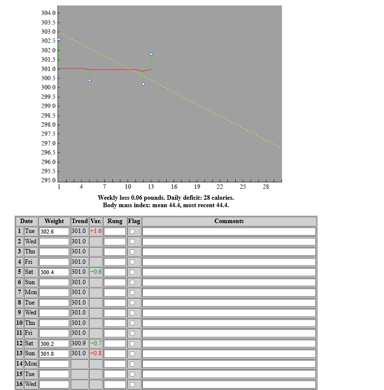

# New Ideas for ChatDiet improvements

## No photo handling necessary

I did not need to use this feature during my two week trial, so lets remove it altogether.
I found it easier to just chat my meals and have the app ask me if anything is not clear.

## Daily progress chart

### Calorie tracking

I want to configure a daily calorie intake goal and see a chart of my progress over time. eg 2000 calories a day.

I would like the daily remaining calories to appear in the header;

Also, i like this type of chart to track my 7 day and 30 day calorie and macro intake:

- 140 P means i age 140 grams of protein
- 61 F means i ate 61 grams of fat
- 195 C means i ate 195 grams of carbs

This a rolling 7 or 30 day chart, so it shows the last 7 or 30 days of my intake. I can see if I am meeting my goals or not.

This chart can be shown on demand, perhaps a button or a keyword in the chat but it is not inline with the chat.
There can be a button, menu item, or chat intention that displays it modally.

This chart is not interactive

## Food tracking

I would like to keep a record of the types of food i eat.
The data recorded for the food would come from the dietary chart for its package.

For example I ate some pretzels today.  The label said there are 110 calories for 28 grams; i can also record the macros from the label.
So store this info in a table.

I have a scale and see that I ate 52 grams, so you would record that i age (110*52/28) 204 calories for 52 grams of pretzels.
This can go into the FOOD_ENTRY table.

Subtract those 208 calories from the 2000 calories in the header so i can see how many calories i have left for the day.

It looks like the FOOD_ITEM table is close to this requirement.

I may not be able to enter every food, so still allow UPC lookup for foods that are not in the FOOD_ITEM table and also
the ability to add them to the FOOD_ITEM table.

The FOOD_ITEM table could also be used to help me generate a shopping list. For now,
if i say something like, "food item shopping list", show me an ordered list of
the items and let me select the ones to go onto a shopping list;

I should also be able say something like "add shredded carrots to the shopping list", so the SHOPPING_ITEM table would be used to store the shopping list items.

## Food Shopping  

For now I am not worried about tracking the cost of food, 
so we can simplify the app by not tracking any costs; please remove any columns related to cost.

Make a "shopping mode" for me to use in stores; to keep it simple just show an ordered list of shopping items that i can check off;
i like the way that Google Keep checkboxes work; each item has a checkbox; when you check it grays out and drops to the bottom of the list;
you can resurrect a grayed out item by unchecking its checkbox.

We also do not need to keep a purchase history for now; just keep a shopping list that i can check off and uncheck.

## Weight management

Drop this whole TDEE feature since it is making life complicated.
Just let me configure a dialy calorie intake goal and track my progress against that goal.
As I lose weight, i can manually adjust the daily calorie intake goal downwards.

For weight tracking, i like the approach that The Hacker's Diet website uses; it seems to keep a rolling average
that is pulled up or down by my sporadic weight entries;

see  

Of course, my weights would come from the WEIGHT_ENTRY table.

Fix the timespan as the last 30 days; i may add more timespans later

This chart is not interactive and not part of the chat flow.  There can be a button, menu item, or chat intention that displays it  modally.

## Offline Mode

The app should work offline by storing chat request locally until the user is back online.  The app should also be able to sync with the server when the user is back online.

There should be a little online status light in the header: green when online, yellow if attempting to reconnect, and red permanently offline;

The app should do a ping to the backend once a minute to check if it is online or offline.  If the ping fails, then the app should go into offline mode and store chat requests locally until the user is back online.
Keep polling once a minute to see if the backend came bac online.  Give up and go permanently offline after 30 minutes.

When in permanent offline mode, implement a button or menu item to allow the user to manually attempt to reconnect to the backend.

Also allow user to view any queued chat requests that have not been sent to the backend yet.  Allow user to delete any queued chat requests.

## Recipe tracking

Remove any recipe tracking features for now; they are not needed and complicate the app.

## Notes and Requirements

Only keep notes; do not differentiate between requirements and notes; they are all notes for now.

Never delete any notes; just add new notes to the end of the file.

## Responsive Design

### Chats

In the app, lets make the chat scrollable so we can alwasy see the header and any menu items.

So at the top we have the header, then the scrollable chat section, and then the input box at the bottom.  The chat section should be scrollable so we can always see the header and any menu items.

Save the chat history on the backend; add a timestamp to each entry; each entry does not need a synthetic key.

### Responsive Layout

The PWA app must be fully responsive and work well on iPhone, Android phones,
iPad, Android tablets, small laptops and large desktop monitors. Verify layouts
at approximately 360px, 390px, 430px, 768px, 1024px and 1440px.

Use mobile-first responsive CSS, with CSS Grid and Flexbox. Build one
responsive website, not separate mobile and desktop applications.

Avoid background-attachment: fixed; iOS Safari handles it badly. Use a fixed
pseudo-element layer instead

### Mobile

Vertical layout with
- header with information and perhaps a pulldown menu
- scrollable chat history
- user input area
- modal 7 day intake graph
- modal weight trend graph

no horizontal scrolling; large touch-friendly buttons; minimum touch
target around 44px; bottom navigation;

forms that fit within the screen; charts that resize correctly; modals that fit small
displays (bottom sheets); safe-area support for modern phones; readable font
sizes; a sticky Add Meal button where helpful. Use 16px form inputs so iOS
Safari does not zoom on focus.

### Desktop

The two graphs can be fully displayed in a right hand sidebar;
the main area can contain the header, scrollable chat history, and user input area

sidebar navigation; centred content area; useful dashboard layout;
multi-column cards when space allows; a maximum readable content width; no
oversized empty sections. Cap the width of any element that would otherwise
stretch absurdly (the heatmap especially). Do not split the dashboard into two
columns so early that the charts become cramped — check how it actually looks
at 1024px before committing to the breakpoint

