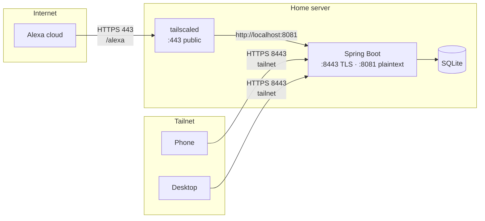

# Tailscale configuration for the Alexa skill

How chat-diet exposes an Alexa endpoint to the public internet without
exposing the app itself.

Companion to `TAILSCALE-certificates.md`, which covers the tailnet-internal
HTTPS setup. This document only covers what changed to accommodate Alexa.

---

## 1. Why anything had to change

§1 of `SPEC.md` originally read:

| Constraint | Value |
|---|---|
| Access | Tailscale on home network. No public exposure. |

That is no longer true, and it was load-bearing — it is the stated reason
there is no auth beyond network isolation.

Alexa custom skills have exactly two hosting shapes: an AWS Lambda function,
or an HTTPS web service. For the web service option Amazon requires that the
service is reachable from the public internet, accepts requests **on port
443**, and presents a certificate from an Amazon-trusted CA. The port is not
negotiable: specifying any other port in the endpoint URL causes Amazon to
fail the request without sending it.

Lambda was rejected. Reaching a tailnet-only backend from Lambda means
running a Tailscale client inside the Lambda container, which adds cold
starts of 2–4 seconds to a request budget that is already tight (see §6),
plus an AWS dependency the project does not otherwise have.

So: one narrow public path, and nothing else.

---

## 2. Port allocation

| Port | Bound by | Visibility | Serves |
|---|---|---|---|
| 443 | tailscaled | **Public** (Funnel) | `/alexa` only |
| 8443 | Spring Boot | Tailnet only | API + PWA |
| 8081 | Spring Boot | `127.0.0.1` only | `/alexa` |

Tailscale Funnel can only listen on 443, 8443, or 10000. Alexa requires 443.
So Funnel takes 443 exclusively, and the app moves to 8443.

A port cannot be Serve (tailnet-only) and Funnel (public) at the same time —
whichever command ran most recently wins and takes the whole port. This is
why the app moved off 443 entirely rather than trying to share it by path.

Spring keeps binding TLS directly on 8443 with the Tailscale-issued
certificate, exactly as before. No reverse proxy, no `tailscale serve`. The
only change to the app's own HTTPS setup is the port number.

---

## 3. Traffic paths



Funnel terminates TLS at the relay boundary and reverse-proxies plaintext to
`localhost:8081`. Traffic is encrypted end to end over the tailnet; the relay
cannot decrypt it.

Port 8081 is a second Tomcat connector bound to `127.0.0.1`, carrying only
the `/alexa` controller. Binding it to loopback is what keeps the LAN out —
if it were published on `0.0.0.0`, every device on the home network could
POST to it.

---

## 4. Prerequisites

Neither of these can be scripted; both are set in the Tailscale admin
console, and Funnel fails with an unhelpful error if either is missing.

1. **HTTPS certificates enabled** for the tailnet. Already true — the app
   uses a Tailscale-issued cert.
2. **The `funnel` node attribute** present in the tailnet policy file:

```json
"nodeAttrs": [
  {
    "target": ["autogroup:member"],
    "attr":   ["funnel"]
  }
]
```

Tailscale 1.38.3 or later, MagicDNS enabled.

---

## 5. Cutover procedure

Order matters. Step 1 is the only irreversible part.

**1. Drain the offline queue on every device.**
IndexedDB is origin-scoped and the origin includes the port. Any writes
pending in the queue at `:443` become unreachable the moment the app moves
to `:8443` — not lost from the database, but stranded in a browser store
nothing will ever read again. Open the queue panel on phone, tablet, and
desktop; confirm zero pending on each.

**2. Move the app to 8443.**
Change `server.port`, republish the Docker port, restart. Verify
`https://<host>.<tailnet>.ts.net:8443/` from a device on the tailnet.
Nothing is public yet, and this step is independently revertible.

**3. Re-install the PWA on each device.**
Remove and re-add at the new origin. The service worker re-registers from
scratch. Update any bookmarks and home-screen shortcuts.

**4. Add the Alexa connector on `127.0.0.1:8081`** with a stub `/alexa`
returning a hardcoded Alexa response envelope. No `ChatService`, no database.
Verify with a local curl.

**5. Add signature verification** to that connector — before it is public,
not after. See §7.

**6. Enable Funnel.** See §6.

**7. Point the ASK console at the endpoint** and test from the simulator.

---

## 6. Enabling Funnel

```bash
sudo tailscale funnel --https=443 --set-path=/alexa http://localhost:8081/alexa
tailscale funnel status
```

**The target must include `/alexa`, not just `http://localhost:8081`.**
`--set-path` strips the mount-point prefix before forwarding by default — a
public request to `/alexa` arrives at a bare `http://localhost:8081` target
as a request for `/` (confirmed by testing: it produced a 404, since neither
`AlexaController` nor `AlexaPathIsolationFilter` recognize a bare `/`).
Including `/alexa` on the target side re-attaches the path so the backend
sees exactly what it's mapped to handle.

Teardown:

```bash
sudo tailscale funnel --https=443 --set-path=/alexa off
```

`--set-path` mounts a single URL path. Anything else on 443 — including the
root — returns 404. This is the whole isolation story: the public surface is
one path, and that path does nothing but signature-check and forward.

### Verifying from outside

```bash
curl -i https://<host>.<tailnet>.ts.net/alexa
```

**This must be run from off the tailnet** — a phone on cellular, not home
wifi. From a tailnet device, MagicDNS resolves the `.ts.net` name directly
over the tailnet and never touches the Funnel relay, so a success proves
nothing.

A `400` from the signature filter is the correct result. It proves the route
works *and* that verification is live.

### ASK console configuration

Endpoint tab → **HTTPS**:

- Default Region: `https://<host>.<tailnet>.ts.net/alexa`
- Certificate type: *My development endpoint has a certificate from a trusted
  certificate authority*

The `.ts.net` certificate is Let's Encrypt-issued, which satisfies the
Amazon-trusted CA requirement. No self-signed certificate handling needed.

---

## 7. Security model

The app has no authentication. The tailnet was the entire perimeter. That
perimeter now has one hole in it, and the following is what fills it.

**Signature verification is mandatory and non-deferrable.** Every request on
`/alexa` must pass, before any parsing or dispatch:

- `Signature-256` and `SignatureCertChainUrl` validation per Alexa's spec —
  cert chain host and path checks, SAN check for `echo-api.amazon.com`,
  chain of trust, signature verification against the raw request body.
- Timestamp within 150 seconds.
- `applicationId` matching this skill's ID.

Use `SkillRequestSignatureVerifier` and `SkillRequestTimestampVerifier` from
the ASK SDK. Do not hand-roll the cert chain validation.

**Path isolation is enforced twice.** Funnel mounts only `/alexa`, and a
filter on the 8081 connector rejects any other path. A config typo should not
expose the API.

**Obscurity is not part of the model.** The `.ts.net` hostname appears in
Certificate Transparency logs and always has. What changed is that something
now answers on it, and that something writes to the database.

**Not mitigated:** denial of service. Funnel bandwidth limits are the only
throttle. Acceptable for a single-user app; rate-limiting the path is a
reasonable addition if it ever matters.

---

## 8. Latency budget

Alexa allows roughly 8 seconds for a response. The public path adds a hop
through the Funnel relay on top of the existing turn cost (Haiku call, tool
dispatch, possible FDC or OFF round trip).

Two mitigations belong in the endpoint, not the network layer:

- **Skip the second model round trip on the voice channel.** When a log tool
  returns `Success`, template the confirmation from the tool payload rather
  than sending results back to Haiku for prose. The numbers are already in
  hand.
- **Tighten the FDC timeout** for voice requests specifically and fall
  through to model estimate rather than blocking.

---

## 9. Spec deltas

`SPEC.md` needs updating in three places:

- **§1 constraints table** — the "No public exposure" row is false. Replace
  with the port split and a pointer to this document.
- **§1 Access row** — "No auth beyond network isolation" needs the caveat
  that `/alexa` is authenticated by Alexa request signature.
- **§11 Deployment** — the diagram shows a single 443 binding. It now shows
  Funnel on 443 and Spring on 8443/8081.

Add an Appendix row recording that public exposure was adopted deliberately,
constrained to one path, and why Lambda was rejected. Without it, the "no
auth" note in §1 reads as a much larger hole than it is.

## Starting the Funnel service

```
C:\Windows\System32>tailscale funnel --bg --https=443 --set-path=/alexa http://localhost:8081/alexa
Available on the internet:

https://<machine>.<tailnet>.ts.net/alexa
|-- proxy http://localhost:8081/alexa

Funnel started and running in the background.
To disable the proxy, run: tailscale funnel --https=443 off
```

(An earlier run of this command used a bare `http://localhost:8081` target,
which produced a 404 for every request - see §6 above for why the target
needs `/alexa` included.)